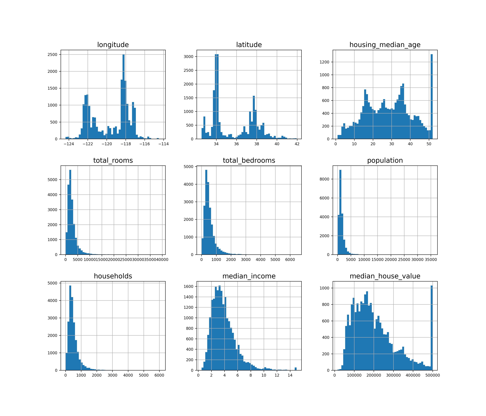

# 100 DAYS OF MACHINE LEARNING
___

This repo consists of my whole 100 days of learning journey and in this file I will be documenting this complete journey !! Let's go !!
___
## Syllabus to cover
This is just a pre-setup and things are added as exploration continues !!

| **S.N.** | **Books and Lessons (Resources)**                                                                                                 | **Status** |
|---------|-----------------------------------------------------------------------------------------------------------------------------------|-----------| 
| **1.**  | [**Hands-On Machine Learning with Scikit-Learn, Keras, and TensorFlow**](https://github.com/ageron/handson-ml3)                   | ⏳         |
| **2.**  | [**Machine Learning Scientist With Python**](https://app.datacamp.com/learn/career-tracks/machine-learning-scientist-with-python) | ⏳|

___

## Projects

| **S.N.** | **Project Title** | **Status**|
|---|---|---|
| 1. | [**California Housing Price Prediction**](https://github.com/iamshishirbhattarai/Machine-Learning/blob/main/California%20Housing%20Price%20Prediction/California_housing_price_prediction.ipynb)| ⏳|
## Topics Learnt Every Day

| **Days**       | **Learnt Topics**                                              | **Resources used** |
|----------------|----------------------------------------------------------------|--------------------|
| [Day 1](Day 1) | EDA, Splitting with random & stratified sampling, correlations |[Hands-On Machine Learning with Scikit-Learn, Keras, and TensorFlow](https://github.com/ageron/handson-ml3)                     |

___

## Day 1 

### California Housing Price Prediction
Today I started to actually create my notebook on 'California housing price prediction' : a project from the book 'Hands-On Machine Learning with Scikit-Learn, Keras, and Tensorflow'.
The tasks I performed and learnt are listed below:

- Loaded the dataset.
   
- Observed dataset distribution.    
  

- Splitted the dataset into training and testing set using both 
 random and stratified sampling.   
     
    1. **Random Sampling :** 
            It is a technique of selecting subset of datas from large dataset in such
  a way that there is a equal chance of each points to be selected. This method doesn't
  introduce any kind of biases.
   
  2. **Stratified Sampling :** 
            It is a technique that is used when we have to deal with imbalanced
  datasets where some datasets are under-presented. It works by providing the
  equal proportion of target variable 'y' of each class in both training and testing sets.
     
- Observed the geographical_distribution. Here, the
size of the points determines the size of *population* and color represents
the *median_house_value*.    
 
- Studied correlations among different variables and found out that the 
*median_income* has good correlation with *median_house_value*.    
     

___

