# 100 DAYS OF MACHINE LEARNING
___

This repo consists of my whole 100 days of learning journey and in this file I will be documenting this complete journey !! Let's go !!
___
## Syllabus to cover
This is just a pre-setup and things are added as exploration continues !!

| **S.N.** | **Books and Lessons (Resources)**                                                                                                 | **Status** |
|----------|-----------------------------------------------------------------------------------------------------------------------------------|------------| 
| **1.**   | [**Hands-On Machine Learning with Scikit-Learn, Keras, and TensorFlow (Part-I)**](https://github.com/ageron/handson-ml3)          | ✅          |
| **2.**   | [**Machine Learning Scientist With Python**](https://app.datacamp.com/learn/career-tracks/machine-learning-scientist-with-python) | ⏳          |

___

## Projects

| **S.N.** | **Project Title**                                                                                                                                                                                | **Status** |
|----------|--------------------------------------------------------------------------------------------------------------------------------------------------------------------------------------------------|------------|
| 1.       | [**California Housing Price Prediction**](https://github.com/iamshishirbhattarai/Machine-Learning/blob/main/California%20Housing%20Price%20Prediction/California_housing_price_prediction.ipynb) | ✅          |
| 2.       | [**Iris Flower Classification**](https://github.com/iamshishirbhattarai/Machine-Learning/tree/main/Iris%20Flower%20Classification)                                                               | ✅          |
| 3.       | [**Breast Cancer Detection**](https://github.com/iamshishirbhattarai/Machine-Learning/blob/main/Breast%20Cancer%20Detection/breast_cancer_detection.ipynb)                                       | ✅          |


## Topics Learnt Every Day

| **Days**        | **Learnt Topics**                                                                                                                                                            | **Resources used**                                                                                                                                                                                                                                  |
|-----------------|------------------------------------------------------------------------------------------------------------------------------------------------------------------------------|-----------------------------------------------------------------------------------------------------------------------------------------------------------------------------------------------------------------------------------------------------|
| [Day 1](Day1)   | EDA, Splitting with random & stratified sampling, correlations                                                                                                               | [Hands-On Machine Learning with Scikit-Learn, Keras, and TensorFlow](https://github.com/ageron/handson-ml3)                                                                                                                                         |
 | [Day 2](Day2)   | Imputation, Estimators, Transformers, Predictors, get_dummies vs OneHotEncoder                                                                                               | [Hands-On Machine Learning with Scikit-Learn, Keras, and TensorFlow](https://github.com/ageron/handson-ml3)                                                                                                                                         |
 | [Day 3](Day3)   | Feature Scaling, Custom Transformers, Pipelines, ColumnTransformers                                                                                                          | [Hands-On Machine Learning with Scikit-Learn, Keras, and TensorFlow](https://github.com/ageron/handson-ml3)                                                                                                                                         |
 | [Day 4](Day4)   | Training and Selecting Model, Evaluating Model, Fine Tuning The Model                                                                                                        | [Hands-On Machine Learning with Scikit-Learn, Keras, and TensorFlow](https://github.com/ageron/handson-ml3)                                                                                                                                         |
  | [Day 5](Day5)   | Fine Tuning Decision Tree & Random Forest, Lasso Regression                                                                                                                  | [Machine Learning Scientist With Python](https://app.datacamp.com/learn/career-tracks/machine-learning-scientist-with-python)                                                                                                                       |
  | [Day 6](Day6)   | Gradient Descent Algorithm, Polynomial Regression, Ridge Vs. Lasso, Elastic Net Regression                                                                                   | [Hands-On Machine Learning with Scikit-Learn, Keras, and TensorFlow](https://github.com/ageron/handson-ml3)                                                                                                                                         |
| [Day 7](Day7)   | Logistic Regression, Softmax Regression, Soft Margin Classification, Support Vector Machines, SVM Kernels                                                                    | [Hands-On Machine Learning with Scikit-Learn, Keras, and TensorFlow](https://github.com/ageron/handson-ml3) <br><br> [StatQuest with Josh Starmer](https://www.youtube.com/watch?v=efR1C6CvhmE)                                                     |
 | [Day 8](Day8)   | SVM Code Implementation, Decision Tree, Hyperparameter Tuning                                                                                                                | [Hands-On Machine Learning with Scikit-Learn, Keras, and TensorFlow](https://github.com/ageron/handson-ml3)                                                                                                                                         |
 | [Day 9](Day9)   | Ensemble learning Intro, Voting Classifiers and its types, Bagging, Pasting & Random Forest, Boosting, AdaBoost                                                              | [Hands-On Machine Learning with Scikit-Learn, Keras, and TensorFlow](https://github.com/ageron/handson-ml3)                                                                                                                                         |
  | [Day 10](Day10) | Gradient Boosting, Learning rate and number of estimator, Stacking                                                                                                           | [Hands-On Machine Learning with Scikit-Learn, Keras, and TensorFlow](https://github.com/ageron/handson-ml3)                                                                                                                                         | 
  | [Day 11](Day11) | XGBoost introduction, Regularization, Fine Tuning, Pipeines, Tuning using pipelines                                                                                          | [Machine Learning Scientist With Python](https://app.datacamp.com/learn/career-tracks/machine-learning-scientist-with-python)                                                                                                                       |
  | [Day 12](Day12) | Curse of dimensionality, Approaches of dimensionality reduction, PCA, Dimensionality reduction & reconstruction                                                              | [Hands-On Machine Learning with Scikit-Learn, Keras, and TensorFlow](https://github.com/ageron/handson-ml3)                                                                                                                                         |
  | [Day 13](Day13) | Feature selection, Feature Extraction, Compression & Decompression using PCA, Variance Threshold, Elbow Mehhod                                                               | [Hands-On Machine Learning with Scikit-Learn, Keras, and TensorFlow](https://github.com/ageron/handson-ml3) <br> <br> [Machine Learning Scientist With Python](https://app.datacamp.com/learn/career-tracks/machine-learning-scientist-with-python) | 
   | [Day 14](Day14) | Initiated a project and prepared a rough notebook (Included many learnt topics)                                                                                              | Self-Compiled-Notes                                                                                                                                                                                                                                 |
   | [Day 15](Day15) | Learnt Deployment using Flask and deployed yesterday's project                                                                                                               | [Youtube](https://www.youtube.com/watch?v=MxJnR1DMmsY&t=838s)                                                                                                                                                                                       |
   | [Day 16](Day16) | Unsupervised Learning, Applications, Clustering, K-means                                                                                                                     | [Hands-On Machine Learning with Scikit-Learn, Keras, and TensorFlow](https://github.com/ageron/handson-ml3)                                                                                                                                         |
   | [Day 17](Day17) | Hierarchical clustering Implementations, Dendrograms and Limitations, K-means Implementation, Elbow-method And Limitations                                                   | [Machine Learning Scientist With Python](https://app.datacamp.com/learn/career-tracks/machine-learning-scientist-with-python)                                                                                                                       |
   | [Day 18](Day18) | Silhouette Coefficient, Document Clustering, Image Segmentation Using Kmeans                                                                                                 | [Hands-On Machine Learning with Scikit-Learn, Keras, and TensorFlow](https://github.com/ageron/handson-ml3) <br> <br> [Machine Learning Scientist With Python](https://app.datacamp.com/learn/career-tracks/machine-learning-scientist-with-python) |
   | [Day 19](Day19) | DBSCAN, Gaussian Model Mixture, Bayesian Gaussian Model Mixture                                                                                                              | [Hands-On Machine Learning with Scikit-Learn, Keras, and TensorFlow](https://github.com/ageron/handson-ml3)                                                                                                                                         |
   | [Day 20](Day20) | Data Preprocessing, Standardizing Data, Feature Engineering, Feature Selection in Machine Learning                                                                           | [Machine Learning Scientist With Python](https://app.datacamp.com/learn/career-tracks/machine-learning-scientist-with-python)                                                                                                                       | 
   | [Day 21](Day21) | Time series data, Loading/Reading Auditory datas, Auditory Envelope, Tempogram, Spectrogram                                                                                  | [Machine Learning Scientist With Python](https://app.datacamp.com/learn/career-tracks/machine-learning-scientist-with-python)                                                                                                                       |
   | [Day 22](Day22) | Predicting Data Over Time, Interpolation in Pandas, Creating Features From The Past, CV of time series data                                                                  | [Machine Learning Scientist With Python](https://app.datacamp.com/learn/career-tracks/machine-learning-scientist-with-python)                                                                                                                       |
   | [Day 23](Day23) | One hot encoding, dummmy encoding, Binarizing And Binning, Dealing with data issues                                                                                          | [Machine Learning Scientist With Python](https://app.datacamp.com/learn/career-tracks/machine-learning-scientist-with-python)                                                                                                                       |
   | [Day 24](Day24) | Dealing with skewed data, Outliers, Standardizing the text data, CountVectorizer, TF-IDF                                                                                     | [Machine Learning Scientist With Python](https://app.datacamp.com/learn/career-tracks/machine-learning-scientist-with-python)                                                                                                                       | 
   | [Day 25](Day25) | Model creation, accuracy metrics(MAE, MSE), confusion matrix, precision/recall, bias-variance trade off                                                                      | [Machine Learning Scientist With Python](https://app.datacamp.com/learn/career-tracks/machine-learning-scientist-with-python)                                                                                                                       |
   | [Day 26](Day26) | KFold(), cross_val_score(), LOOCV                                                                                                                                            | [Machine Learning Scientist With Python](https://app.datacamp.com/learn/career-tracks/machine-learning-scientist-with-python)                                                                                                                       |
   | [Day 27](Day27) | Parameters Vs. Hyperparameters, Manual and Automatic Hyperparameter analyzing, Learning Curves, Grid Search                                                                  | [Machine Learning Scientist With Python](https://app.datacamp.com/learn/career-tracks/machine-learning-scientist-with-python)                                                                                                                       |
   | [Day 28](Day28) | Random Search, Coarse To Fine Tuning, Bayesian Statistics, Genetic Algorithm                                                                                                 | [Machine Learning Scientist With Python](https://app.datacamp.com/learn/career-tracks/machine-learning-scientist-with-python)                                                                                                                       |
   | [Day 29](Day29) | Regular Expressions, Tokenization, Bag-Of-Words, Stop Words, Lemmatization, Gensim                                                                                           | [Machine Learning Scientist With Python](https://app.datacamp.com/learn/career-tracks/machine-learning-scientist-with-python)                                                                                                                       |
   | [Day 30](Day30) | Named Entity Recognition with nltk, SpaCy and Polyglot                                                                                                                       | [Machine Learning Scientist With Python](https://app.datacamp.com/learn/career-tracks/machine-learning-scientist-with-python)                                                                                                                       |
   | [Day 31](Day31) | Use of CountVectorizer & TfidfVectorizer for text classification, Introduction to Naive Bayes Classifier                                                                     | [Machine Learning Scientist With Python](https://app.datacamp.com/learn/career-tracks/machine-learning-scientist-with-python)                                                                                                                       |
   | [Day 32](Day32) | spaCy NLP Pipelines And Familiarity with the syntax                                                                                                                          | [Machine Learning Scientist With Python](https://app.datacamp.com/learn/career-tracks/machine-learning-scientist-with-python)                                                                                                                       | 
   | [Day 33](Day33) | Dependency Parsing, spaCy Vocabulary, Similarity Score                                                                                                                       | [Machine Learning Scientist With Python](https://app.datacamp.com/learn/career-tracks/machine-learning-scientist-with-python)                                                                                                                       |
   | [Day 34](Day34) | Data analysis with spaCy, customizing spaCy model                                                                                                                            | [Machine Learning Scientist With Python](https://app.datacamp.com/learn/career-tracks/machine-learning-scientist-with-python)                                                                                                                       |
   | [Day 35](Day35) | [**Breast Cancer Detection**](https://github.com/iamshishirbhattarai/Machine-Learning/blob/main/Breast%20Cancer%20Detection/breast_cancer_detection.ipynb) Project Started   | [Hands-On Machine Learning with Scikit-Learn, Keras, and TensorFlow](https://github.com/ageron/handson-ml3)                                                                                                                                         |
   | [Day 36](Day36) | [**Breast Cancer Detection**](https://github.com/iamshishirbhattarai/Machine-Learning/blob/main/Breast%20Cancer%20Detection/breast_cancer_detection.ipynb) Project Completed | [Hands-On Machine Learning with Scikit-Learn, Keras, and TensorFlow](https://github.com/ageron/handson-ml3)                                                                                                                                         |         
   | [Day 37](Day37) | Introduction to Neural Networks, Activation & Basic syntax of PyTorch                                                                                                        | [Machine Learning Scientist With Python](https://app.datacamp.com/learn/career-tracks/machine-learning-scientist-with-python)                                                                                                                       |
   | [Day 38](Day38) | Forward & Backward Pass, Loss function, Optimizers, Training Loop                                                                                                            | [Machine Learning Scientist With Python](https://app.datacamp.com/learn/career-tracks/machine-learning-scientist-with-python)                                                                                                                       |
   | [Day 39](Day39) | RELU, Learning Rate & Momentum, Transfer Learning, Loading the dataset, Evaluating & Improving Model Performances                                                            | [Machine Learning Scientist With Python](https://app.datacamp.com/learn/career-tracks/machine-learning-scientist-with-python)                                                                                                                       |
   | [Day 40](Day40) | Training Robust Neural Networks (Using OOP)                                                                                                                                  | [Machine Learning Scientist With Python](https://app.datacamp.com/learn/career-tracks/machine-learning-scientist-with-python)                                                                                                                       |
   | [Day 41](Day41) | Image and Convolutional Neural Networks                                                                                                                                      | [Machine Learning Scientist With Python](https://app.datacamp.com/learn/career-tracks/machine-learning-scientist-with-python)                                                                                                                       |
   | [Day 42](Day42) | RNN, LSTM, GRU                                                                                                                                                               | [Machine Learning Scientist With Python](https://app.datacamp.com/learn/career-tracks/machine-learning-scientist-with-python)                                                                                                                       |                                                                                                                                                                                                                                                     |
   | [Day 43](Day43) | Multi-input and Multi-output Models                                                                                                                                          | [Machine Learning Scientist With Python](https://app.datacamp.com/learn/career-tracks/machine-learning-scientist-with-python)                                                                                                                       |
   | [Day 44](Day44) | RGB to GrayScale & Vice-Versa , Flipping Images, Thresholding                                                                                                                | [Machine Learning Scientist With Python](https://app.datacamp.com/learn/career-tracks/machine-learning-scientist-with-python)                                                                                                                       |
   | [Day 45](Day45) | Edge Detection, Gaussian Smoothing, Contrast enhancement                                                                                                                     | [Machine Learning Scientist With Python](https://app.datacamp.com/learn/career-tracks/machine-learning-scientist-with-python)                                                                                                                       |
   | [Day 46](Day46) | Transformations, Morphology, Image Restoration                                                                                                                               | [Machine Learning Scientist With Python](https://app.datacamp.com/learn/career-tracks/machine-learning-scientist-with-python)                                                                                                                       |
   | [Day 47](Day47) | Noise, Superpixels, Segmentation                                                                                                                                             | [Machine Learning Scientist With Python](https://app.datacamp.com/learn/career-tracks/machine-learning-scientist-with-python)                                                                                                                       |


___
## Day 1 

### California Housing Price Prediction
Today I started to actually create my notebook on 'California housing price prediction' : a project from the book 'Hands-On Machine Learning with Scikit-Learn, Keras, and Tensorflow'.
The tasks I performed and learnt are listed below:

- Loaded the dataset.
<br> <br>
- Observed dataset distribution. <br> <br>
  


- Split the dataset into training and testing set using both 
 random and stratified sampling.  <br>
    <br>
    1. **Random Sampling :** 
            It is a technique of selecting subset of datas from large dataset in such
  a way that there is an equal chance of each points to be selected. This method doesn't
  introduce any kind of biases.
<br> <br>
  2. **Stratified Sampling :** 
            It is a technique that is used when we have to deal with imbalanced
  datasets where some datasets are under-presented. It works by providing the
  equal proportion of target variable 'y' of each class in both training and testing sets.
  <br> <br>
- Observed the geographical_distribution. Here, the
  size of the points determines the size of *population* and color represents
  the *median_house_value*. <br> <br>
 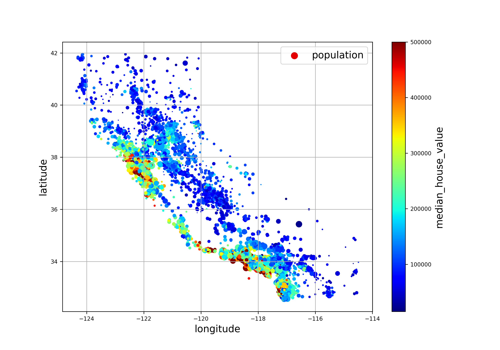
- Studied correlations among different variables and found out that the 
*median_income* has good correlation with *median_house_value*. <br>  
     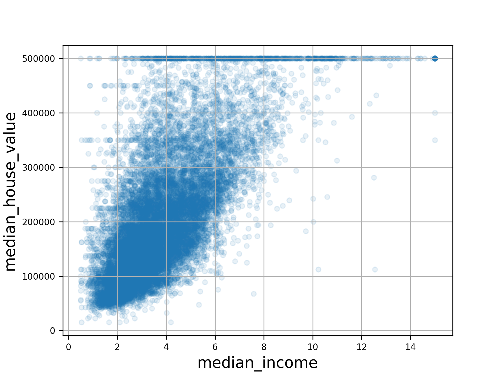

___

## Day 2

### Continuing California Housing Price Prediction

I continued the ongoing project i.e. **California Housing Price Prediction** and got to apply some exciting stuffs that I
have learnt. Key learnings and tasks performed are listed below:
<br> <br>
- Experimented with various attributes combinations.
    ``` python
    #Finding room per house
    housing['room_per_house'] = housing['total_rooms'] / housing['households']
    #Finding bedrooms_ratio 
    housing['bedrooms_ratio'] = housing['total_bedrooms'] / housing['total_rooms']
    #Finding people_per_house
    housing['people_per_house'] = housing['population'] / housing['households'] 
    ```
- Performed **Imputation** on missing datas using **median** strategy and converted transformed dataset to a DataFrame
   <br> <br> **Imputation**: It is the process of setting null values to some values such as zero, the mean, the median,
etc. I used Scikit-learn's class **SimpleImputer** and applied **median** strategy. The code snippet is as follows:
    ``` python
    from sklearn.impute import SimpleImputer
    imputer = SimpleImputer(strategy = "median")
    
    #Separating numerical-valued attributes as housing_num
    housing_num = housing.select_dtypes(include = [np.number])
    imputer.fit(housing_num)
    X = imputer.transform(housing_num)
    #Converting X into a dataframe
    housing_tr = pd.DataFrame(X, columns = housing_num.columns,
                              index = housing_num.index)
    ```
- Learnt about some frequently used terminologies **estimators**, **transformers** and **predictors** in Scikit Learn.
    <br> <br> 
        **i. Estimators :** Any object that estimates some parameters on the basis of dataset is an estimator. It is
    performed by *fit()* function. **SimpleImputer** is an example of estimator. <br> <br>
        **ii. Transformers :** Any object that is capable to transform the dataset is a transformer. It uses 
    *tranform()* function. **SimpleImputer** is also a transformer. Both estimation & transform can be done at once by
    using *fit_transform()* method. <br> <br>
        **iii. Predictors :** The estimator capable of making predictions with a dataset given is a predictor. 
    **LinearRegression* is a predictor which uses **predict()** function to make predictions. <br> <br>
- Understood the differences in using *get_dummies* from *pandas* and *OneHotEncoder* from *Scikit-Learn*
   <br> <br> 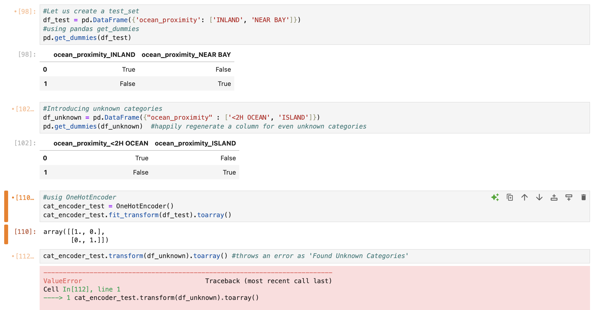
        <br> 
   *OneHotEncoder* remembers which categories it was trained on while *get_dummies* doesn't remember. As shown in above
screenshot of notebook where both were trained on same datas. In case of pandas, when dataset with unknown categories
was asked to transform, it happily regenerated column for even unknown categories while *OneHotEncoder* throws error !!

___

## Day 3
### Continued California Housing Price Prediction

Today I learnt a very crucial step in Machine Learning i.e. **Feature Scaling And Transformation**. Below are few
summarization of my learnings and performed tasks:

- Performed two types of scaling: <br> <br>**i. Min-Max Scaling :** For this scaling I used *Scikit-Learn* 's *MinMaxScaler* class. This is the simplest
scaling method that is performed by subtracting the min value and dividing by the difference of the min and the max.

    ```python
    from sklearn.preprocessing import MinMaxScaler
    
    min_max_scaler = MinMaxScaler(feature_range = (-1,1))
    housing_min_max_scaled = min_max_scaler.fit_transform(housing_num) 
   ```

    **ii. Standarization :** For this scaling I used *Scikit-Learn* 's *StandardScaler* class. It is performed by subtracting
with mean and dividing by the standard deviation.

    ```python
    from sklearn.preprocessing import StandardScaler
    
    std_scaler = StandardScaler()
    housing_num_std_scaled = std_scaler.fit_transform(housing_num)
    ```


- Learnt about transforming target values. When we transform target values, it is very necessary to inverse the 
transformation while providing the predicted values. Suppose we replaced the target value with it's logarithm, the
output will also be in logarithm. So, for this I can use *inverse_transform()* method from Scikit's Learn. But, rather
I chose a simpler option and decided to use *TransformedTargetRegressor* that simply provides the output by inversing
the transform. 

    ```python
    #Using TransformedTargetRegressor
    from sklearn.compose import TransformedTargetRegressor
    from sklearn.linear_model import LinearRegression
    
    model = TransformedTargetRegressor(LinearRegression(), transformer = StandardScaler())
    model.fit(housing[["median_income"]], housing_labels)
    some_new_data = housing[["median_income"]].iloc[:5]
    predictions = model.predict(some_new_data)
    ```
- Learnt to make simple **custom transformer**. Here, I simply transformed the *population* as logarithm of *population*
and visualize the original and logarithmic population to see the changes in distribution of the data.    
    ```python
    #Applying logarithmic transformation in population as the datas are skewed
    from sklearn.preprocessing import FunctionTransformer
    
    log_transformer = FunctionTransformer(np.log, inverse_func = np.exp)
    log_pop = log_transformer.transform(housing['population'])
    fig, ax = plt.subplots(nrows = 1, ncols = 2, figsize = (12,6))
    ax[0].hist(housing['population'], bins=50)
    ax[0].set_xlabel('Original Populaton')
    ax[1].hist(log_pop, bins=50)
    ax[1].set_xlabel('Log of Population')
    plt.savefig("log_population_vs_population.png", dpi = 300)
    plt.show()
    ```
  **Output :** <br><br>
  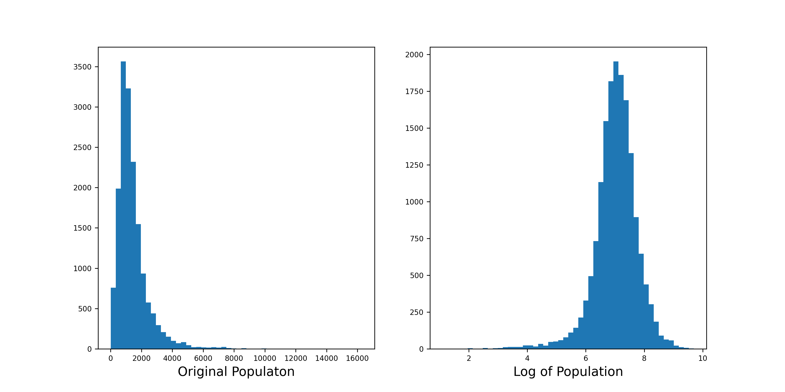  
<br> <br>
- Applied **pipelines** and **ColumnTransformers** 
<br> <br>
**i. Pipelines :** It is simply a sequence of transformations. For this, we can use *Pipeline* or *make_pipeline* class
from *Scikit-Learn*. If we prefer *Pipeline* we need to provide name/estimators pairs defining a sequence of steps, while
in *make_pipeline* we can simply provide estimators. <br> <br>
**Pipeline Implementation Code :**
    ```python
    from sklearn.pipeline import Pipeline
    num_pipeline = Pipeline([
       ("impute", SimpleImputer(strategy="median")),
       ("standardize", StandardScaler()),
    ])
   ```

    **make_pipeline Implementation Code:**
    ```python
    from sklearn.pipeline import make_pipeline
    num_pipeline = make_pipeline(SimpleImputer(strategy="median"), StandardScaler())
    ```
  
    **ii. ColumnTransformers :** The *ColumnTransformer* in *scikit-learn* is a powerful tool that allows you to apply 
different preprocessing pipelines to different subsets of features within your dataset. This is particularly useful
when you have a mix of numerical, categorical, and other types of data that require different transformations.
We have **ColumnTransformer** and **make_column_transformer** and the difference is same as in pipelines i.e.
**make_column_transformer** doesn't need naming. <br> <br>
**ColumnTransformer Implementation Code :**
    ```python
    from sklearn.compose import ColumnTransformer
    num_attribs = ["longitude", "latitude", "housing_median_age", "total_rooms",
                  "total_bedrooms", "population", "households", "median_income"]
    cat_attribs = ["ocean_proximity"]
    cat_pipeline = make_pipeline(
       SimpleImputer(strategy="most_frequent"),
       OneHotEncoder(handle_unknown="ignore"))
    preprocessing = ColumnTransformer([
       ("num", num_pipeline, num_attribs),
       ("cat", cat_pipeline, cat_attribs),
    ])
    ```
  **make_column_transformer Implementation Code :**
    ```python
  from sklearn.compose import make_column_selector, make_column_transformer
  preprocessing = make_column_transformer(
     (num_pipeline, make_column_selector(dtype_include=np.number)),
     (cat_pipeline, make_column_selector(dtype_include=object)),
  )
  ```
  Here, *make_column_selector* is used to select the specific type of features in the dataset. 


- Applied almost all the transformations that we did before with the help of pipelines and column transformers with the code screenshot
attached below: <br> <br>
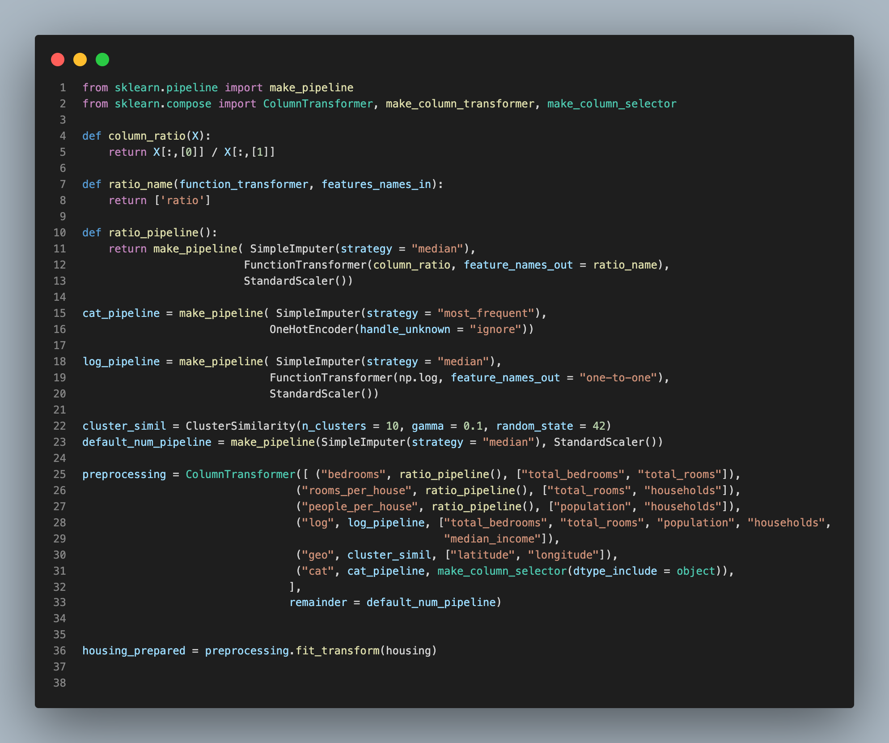

___

## Day 4
### Completed 'California Housing Price Prediction'

Today I worked on selecting and training model as well as fine tuning the best model so far to optimize the performance.
Below are some of my learnings and understandings : <br> <br>
- Trained the model using LinearRegression, DecisionTreeRegressor and RandomForestRegressor. LinearRegression doesn't 
work fine on training set, DecisionTreeRegressor worked absolutely fine on training set but failed on Cross-Validation, 
but RandomForestRegressor worked fine on training set and comparatively better on Cross-Validation.
    <br> <br>
    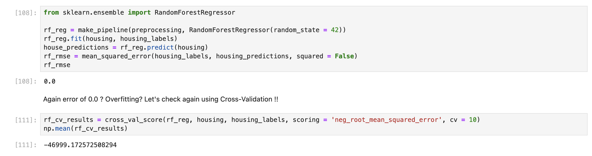

- Fine tuned the model using both Grid search and Randomized Search. Randomized Search worked properly compared to Grid
Search. Screenshot of the notebook are attached below:
<br> <br>
    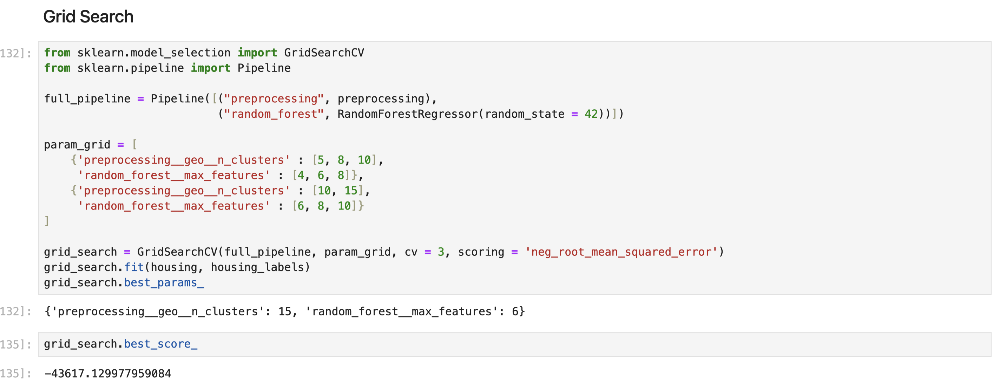
    <br> <br> 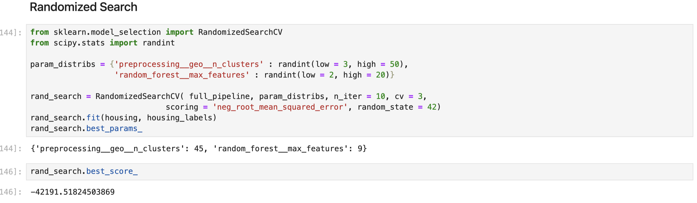


- Chose the *rand_search* as the *final_model* and evaluated the model using test set and found out it worked better than
with cross-validation. <br> <br>
    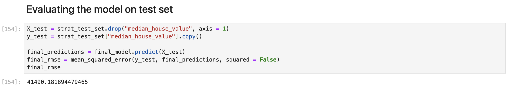

I had already learnt all of these techniques but haven't ever applied on any projects. So, this project was a great
start to implement my learning practically.

___

## Day 5

Today I thought of continuing the course that I had started prior to this challenge. The course is within the track
**'Machine Learning Scientist With Python'** from **DataCamp**. So, I completed the **"Machine Learning with Tree-Based Models in Python"**
course and also did a course-based-project where I was asked to build models and find the best model for predicting the
movie rental durations. I applied almost the same concepts and techniques as yesterday. Additional to them, I performed
LASSO regression. LASSO regression is used for regularization of a model to prevent overfitting. Few of the snapshots of
today task are provided below:

- **Dataset Preparation and Splitting :** <br> <br>
    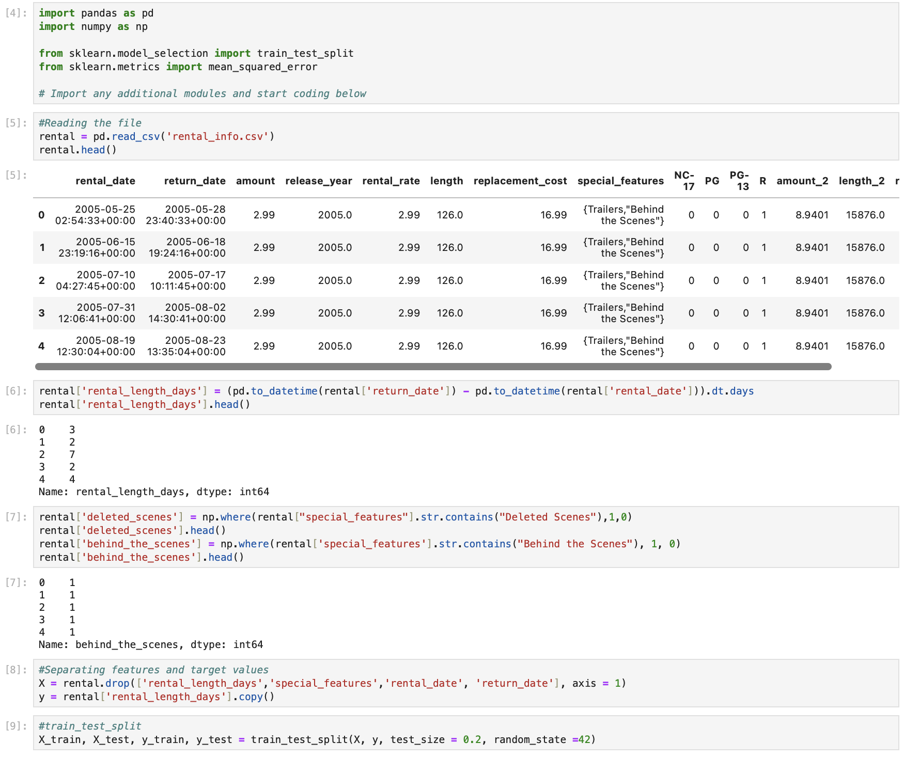 <br> <br>
- **Building and Selection of the best model :** <br> <Br>
 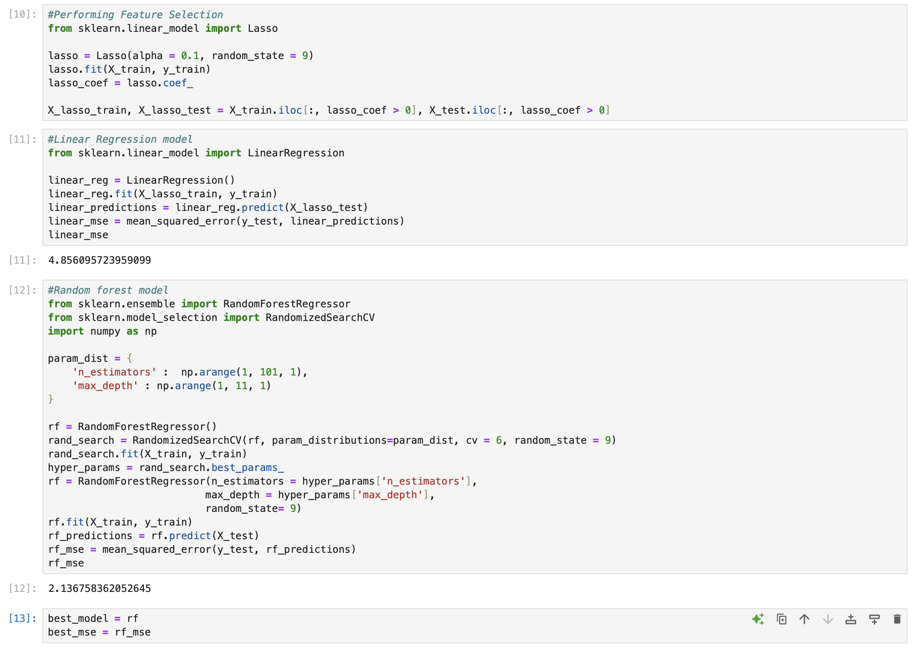

___

## Day 6

Today I started reading Chapter-4: **Training models** of **Hands-On Machine Learning** book. I learnt the following
things:

- I got to revised about Linear Regression model and Gradient Descent Algorithm. Gradient Descent Algorithm is a generic
algorithm which is capable of finding optimal solution from a wide range of problems. I had already learnt this and created
a notebook on this which you can visit by clicking here : [**Gradient Descent Notebook**](https://github.com/iamshishirbhattarai/Machine-Learning/tree/main/Gradient%20Descent%20Algorithm)
<br> <br>
- Additional to the pure Gradient Descent, I also read about *Batch Gradient Descent* that performs calculations over
full training set in every epoch. <br>The next type is *Stochastic Gradient Descent* that picks a random instance in the 
training set and computes the gradient based on the single instance.<br> There is a *Mini-Batch Gradient Descent* that
takes a set of instances randomly and computes the gradient.
<br> <br>
- Learnt to implement **Polynomial Regression** as follows:
   ```python
  #Data generation
  import numpy as np
  
  np.random.seed(42)
  m = 100
  X = 6 * np.random.rand(m, 1) - 3 
  y = 0.5 * X ** 2 + X + 2 + np.random.randn(m, 1)
  
  #Visualizing the datas
  import matplotlib.pyplot as plt

   plt.plot(X, y, "b.")
   plt.xlabel("X")
   plt.ylabel("y")
   plt.grid()
   plt.show()
  ```
  
    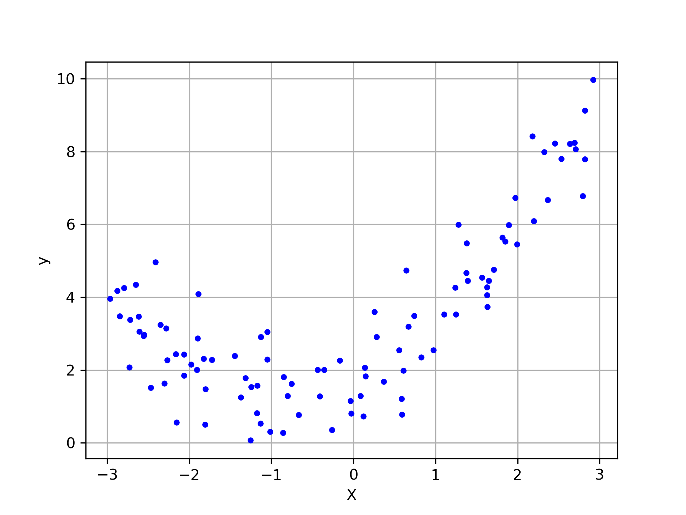

  ```python
  #polynomial regression using scikit-learn
  from sklearn.preprocessing import PolynomialFeatures
  from sklearn.linear_model import LinearRegression
  poly_features = PolynomialFeatures(degree = 2, include_bias = False)
  X_poly = poly_features.fit_transform(X)
  lin_reg = LinearRegression()
  lin_reg.fit(X_poly, y)
  
  #Trying with new datas
  X_new = np.linspace(-3, 3, 100).reshape(100, 1)
  X_new_poly = poly_features.transform(X_new)
  y_new = lin_reg.predict(X_new_poly)

  plt.plot(X, y, "b.")
  plt.plot(X_new, y_new, "r-", linewidth = 2, label="Predictions")
  plt.xlabel("X")
  plt.ylabel("Y", rotation = 0)
  plt.legend() 
  plt.show()
  ```
   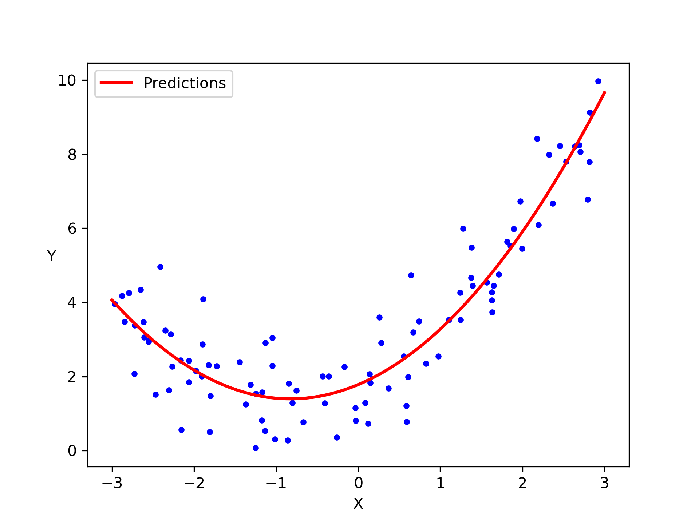  
<br> <br>
- I deeply understood about Regularization models today. The regularization is the process of encouraging the learning
algorithms to shrink the values of the parameter to avoid overfitting during training. The three regularization models
are explained below: <br> <br>
**i. Ridge Regression :** It is the type of regularization model which is used when most of the variables are useful.
     The function minimizes: <br><br>
 **Sum of the squared residuals + lambda * weight ^ 2** <br> <br>

    **ii. Lasso Regression :** It is the type of regularization model which is used when we have to exclude some useless 
variable i.e. it is capable of excluding useless variable from equations.
 <br>
 The function minimizes: <br><br>
 **Sum of the squared residuals + lambda *  |weight|**
    <br> <br>
   **iii. Elastic Net Regression :** It is a middle ground between the Ridge and Lasso Regression. The regularization 
term is a weighted sum of both ridge and lasso's regularization term, controlled with the mix ratio *r*.
  <br>
 The function minimizes: <br> <br>
 **Sum of the squared residuals + r * lambda * |weight| + (1-r) * lambda * weight ^ 2**

___
 
## Day 7

I finished the chapter 4 about **Training Models** from the book and started reading the next chapter which is about 
**Support Vector Machines (SVM)**. In the remaining portion of the chapter 4, there was about **Logistic Regression** 
and **Softmax Regression** where both are used for classification problem. Presenting my readings with following points:

- **Logistic Regression** is a type of regression algorithm that are used for binary classification problem. It uses 
*Sigmoid Function* and provides the output between 0 and 1. There is a decision boundary set which impacts the output of
the model. It can be implemented using **LogisticRegression** class in Scikit-Learn as follows:
   ```python
   from sklearn.linear_model import LogisticRegression
   from sklearn.model_selection import train_test_split
   from sklearn.metrics import accuracy_score
  
   X = iris.data[["petal width (cm)"]].values
   y = iris.target_names[iris.target] == 'virginica'
   X_train, X_test, y_train, y_test = train_test_split(X, y, random_state = 42)
   log_reg = LogisticRegression()
   log_reg.fit(X_train, y_train)
   y_pred = log_reg.predict(X_test)
   score = accuracy_score(y_test, y_pred) 
   ```
- **Softmax Regression** is a type of regression algorithm that is used for more than two classes or in general used for 
multiclass problem. This algorithm computes its respective output of each class and decides the class with higher score.
In Scikit-Learn, **LogisticRegression** class works as **Softmax** whenever multiple class is provided.

    ```pyton
     X = iris.data[["petal length (cm)", "petal width (cm)"]].values
     y = iris["target"]
     X_train, X_test, y_train, y_test = train_test_split(X, y, random_state = 42)

     softmax_reg = LogisticRegression(C=30, random_state = 42) #C is the hyperparameter
     softmax_reg.fit(X_train, y_train)
    ```
- **Soft Margin Classifier** also known as Support vector Classifier that allows flexibility in model by allowing some 
mis-classification when the datas are not perfectly separable. In contrast to this, **Hard Margin Classifier** is a 
strict classifier that tries to perfectly separate the datas to their belonging classes.
<br> <br>
- **Support Vector Machine** is used for both classification and regression. The main objective of SVM is to find the 
optimal hyperplane in an N-dimensional space that can separate the data points in different classes in different feature
space. It starts with data in a relatively low dimension and then move datas into a higher dimension and ultimately finds
a support vector classifier that separates the higher dimensional data into classes. <br>
<br> It uses **Kernel Functions** to transform the data into higher dimension. Well, they don't actually do the transformation
rather only calculates the relationship between every pair of points as if they are in higher dimension. This technique
is know as **Kernel Trick** that helps by reducing computation.
<br> <br>
I learnt about two types of **Kernel Function** today. They're discussed below:
<br> <br>
    **i. Polynomial Kernel :** It systematically increases dimensions and relationships between each pairs of observations
are used to find a support vector classifier.
   <br> <br>
    **ii. Radial Kernel :** In simpler way, I understood this as that the closest observation have a lot of influence while
farther has relatively little influence on the classification. Whichever is closer. It finds the support vector classifier in
infinite dimensions.

___

## Day 8


Today I completed the current chapter about SVM and started reading the next chapter about Decision Trees. The stuffs I learnt are listed below:

- I saw few code implementations on SVM that I had learnt yesterday. Well there wasn't a proper implementation from scratch
given, so It was just like being familiar with the syntax of each classifier and regression. I will get back to this topic,
whenever I find opportunities to explore it in detail. Just a representative image of the non-linear classification performed
using SVM : <br> <br>
 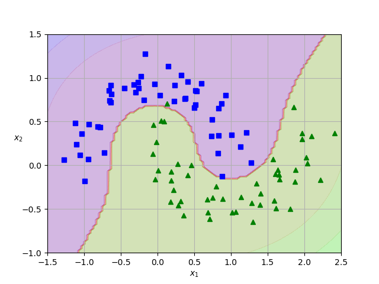
<br><br>

- I read (rather say revised) about Decision Trees. I have already seen lots of the portion while taking other
courses. I trained, learnt about how decision trees works and also regularized hyperparameters with the help of 
Grid search finding the optimized and the best parameters. Both classifications and regression problem can be solved
by using Decision Tree. However, the regularization in decision tree is very necessary. If not done, the decision tree is
prone to overfitting. I learnt about Gini INdex and Entropy; the approaches followed for dividing the tree. Additionally,
performed an exercise which was at the end of the chapter which you can visit clicking here: 
[Exercise_Notebook](Day8/decision_trees.ipynb)
<br> A graphical representation of the tree from the exercise is provide below:
<br> <br>
    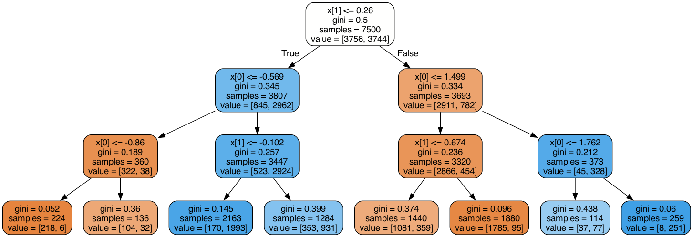


___

## Day 9

Today I started learning about **Ensemble Learning** from the book. Below are few summaries on what I learnt : 

- I first learnt about **Voting Classifier** which is one of the Ensemble learning methods. In this method, as defined by its
name, it provides the aggregate of all the classifiers used or provide the class as an output with maximum votes. It performs
better than individual classifier. There are two types of Voting Classifier. They are discussed below:
<br> <br>
    **i. Hard Voting Classifier** is a type of Voting Classifier that predicts the class with major votes. By default,
scikit learn's **VotingClassifier** class performs *hard voting*.
  <br> <br>
   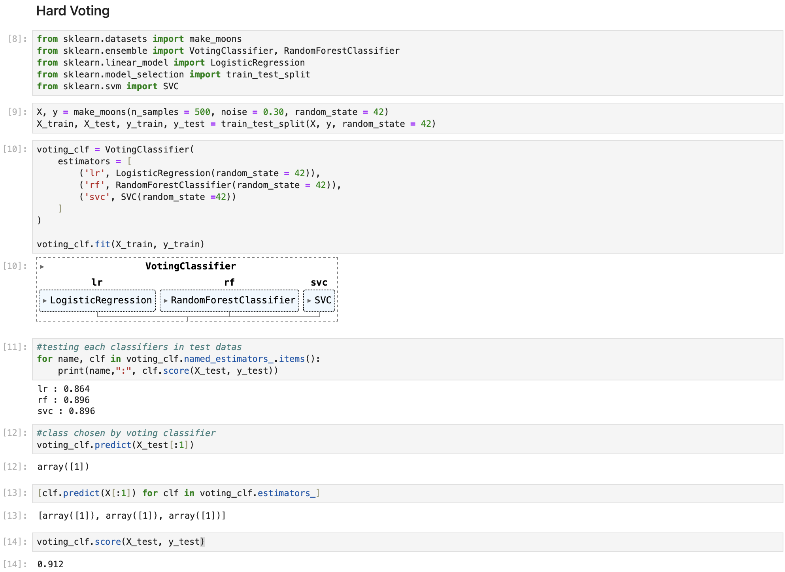
    <br> <br>
    **ii. Soft Voting Classifier** is a type of Voting Classifier that predicts the class with the highest class probability,
averaged over all the individual classifiers.In Scikit learn, we have to set voting as "soft" to enable soft voting as shown 
in the screenshot of notebook below:
   <br> <br>
    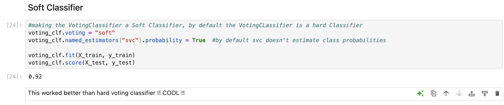


- Got a solid concept on **Bagging**. **Bagging** stands for **Bootstrap Aggregating** and is an ensemble method that uses
same training algorithm for every predictors but train them on different subsets of the training set. When sampling is done
with replacement, the method is **Bagging**. If sampling is done without replacement, then it is called **Pasting**. I also
performed **Out-Of-Bag(OOB)** evaluation. A screenshot of a notebook for bagging is attached below: 
<br> <br>
   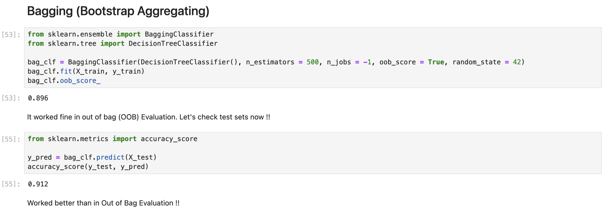
<br> <br>
- Performed **Random Forest** on the same dataset with the concept of bagging in the mind. It is also a type of bagging, but
it samples both training sets as well as features. I am implementing this from the very beginning of my journey so just 
attaching a screenshot down below: <br> <br>
    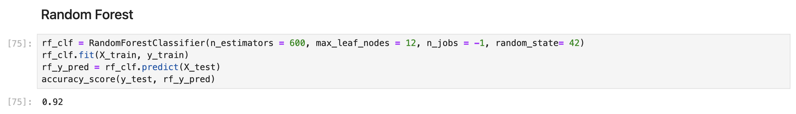
<br> <br>
- Got familiar with **Boosting** concept. Boosting is also an ensemble learning method that trains predictors sequentially
, each trying to correct its predecessors. Well, there are many boosting mechanism, but today I just focused on
**AdaBoost**. <br> <Br>

- **AdaBoost** is a boosting algorithm that pays more attention to those training instances that predecessor underfits on.
An implementation sample :
 <br> <br>
    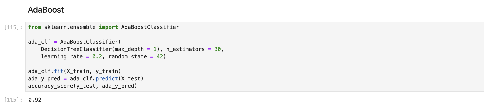

___

## Day 10

Today I finished reading about **Ensemble Learning**. I got introduced to a new method known as **Stacking** while reading
this and also got a better chance to revise and know additional stuffs on **Gradient Boosting** too. Summaries of today's 
learnings are provided below: 

- Learnt about **Gradient Boosting**. **Gradient Boosting** is a type of boosting algorithm that works by performing sequential
correction of predecessor's error but do not tweak the weights of training instances as **AdaBoost** rather fits each predictor
using its predecessor's residual errors as labels/target. An implementation of how does it works and the direct implementation
through Scikit Learn's **GradientBoostingRegressor** can be found in the following screenshot:
<br> <br>

    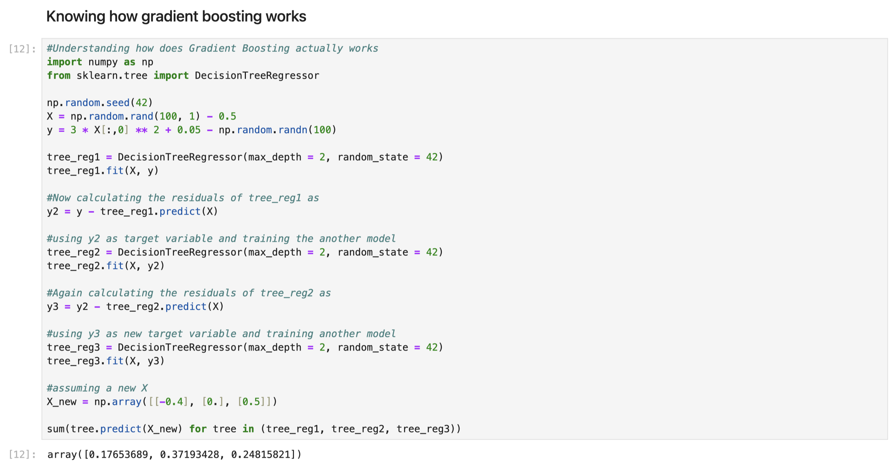 <br> <br>
    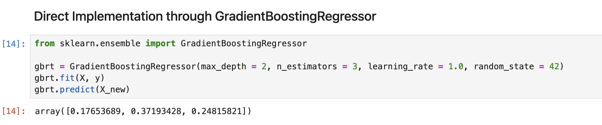 <br> <br>

- **Learning Rate** in **Gradient Boosting** is one of the most important _hyperparamemter_. It is a number between 0 and 1 that
adjusts the shrinkage factor i.e. in general, controls how fast the model is learning. In another words, it determines 
the contribution of each tree in the final outcome. Decreasing the learning rate has to be compensated by
increasing the number of estimators in order for the ensemble to reach a certain performance i.e. there is a trade-off 
between **learning rate** and **no- of estimators**.
<br> <br>
- **Finding optimal number of trees** is one of the must done task while performing **Gradient Boosting**. We can use 
previously used fine tuning methods with **Grid Search** or **Random Search**. But, **Gradient Boosting** offers _n_iter_no_change_
hyperparameter that allows us to put integer values (say 8) that helps to automatically stop adding more trees if it observed that
the last 8 trees didn't help. <br> <br>
    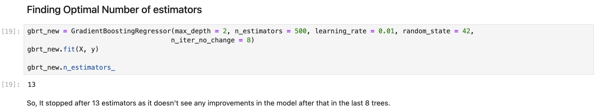
<br> <br>
- Got to know about another **Ensemble Learning** method : **Stacking**. It seems similar to the **Voting Classifier** but in this
learning, there is a model to perform the aggregation of the predictions. Such model is known as _blender_ or _meta learner_ and 
the model in which the original datasets are trained is known as base model. This was a great learning, and I performed the
same task that I did in **Voting Classifier** yesterday with **Stacking** and found working comparatively well. A screenshot
of the notebook is attached below: <br> <br>
    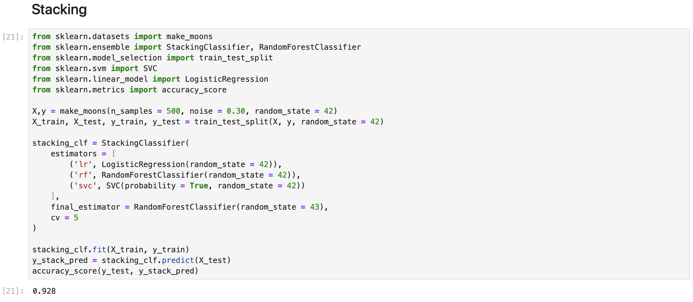

___

## Day 11

Today I started a course within the **Machine Learning Scientist With Python** from  **DataCamp**. The course was
**Extreme Gradient Boosting with XGBoost**. So, today it was the day for **XGBoost**. Compiling my learnings in following
points:

- **XGBoost** is an optimized gradient-boosting machine learning library that provides greater speed and performance.
It is one of the most popular algorithm that has consistently outperformed single-algorithm methods. As compared to normal
gradient boosting that we performed yesterday, **XGBoost** is more scalable, has built in regularization, provides
parallelization, sophisticated tree-pruning and many other advanced features. A quick example of **XGBoost** implementation 
is shown below: <br> <br>
    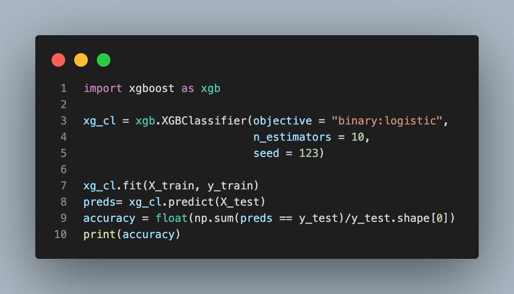 <br> <br>

- Learnt about when to use **XGBoost** and when not to. It is used whenever there are large no. of training samples and has 
mixture of categorical and numerical features or just numerical features while it is not used in Image recognition,
computer vision, NLP and understanding problems and those problems with very few training samples.
<br> <br>
- Learnt about **Objective(Loss) Functions** and regularization in **XGBoost**.
<br> <br>
- Performed hyperparameter tuning using **Grid Search** and **Randomized Search**. Each has their own advantages and limitations.
A Quick example of **GridSearch** implementation is as follows: <br> <br>
    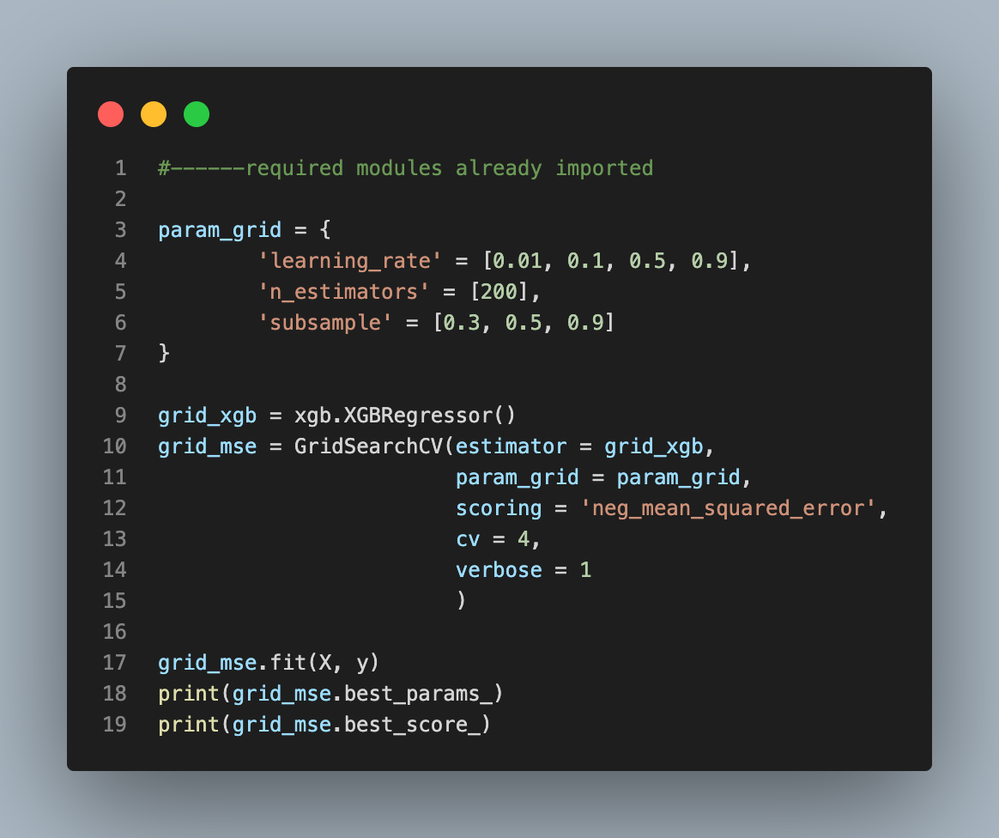
<br> <br>
- Performed **XGBoost** using pipeline and also tuned hyperparameters in pipeline. These are as similar as we previously 
performed while doing **California Housing Price Prediction** project. So, it was just a good revision. 
    
___

## Day 12

Today I started learning about **Dimensionality Reduction**. Let me compile my learnings in the following points:

- **Curse of Dimensionality**: Having very large no. of features for each training instances, makes not only training 
extremely slow but also make it much harder to find the solution. The problem is referred to as the **curse of dimensionality**
Also, the more dimensions the training set has, the greater the risk of overfitting is. So, these problems are often addressed
by **Dimensionality Reduction**.<br> <br>
- There are basically two approaches for dimensionality reduction: <br><br>
  **i. Projection :** It is an approach for dimensionality reduction that reduces the datas in higher dimensions to the lower
dimensions assuming that they can be represented linearly. <br> <br>
  **ii. Manifold Learning :** It is another approach for dimensionality reduction that represents the data in higher dimensions
to the lower dimensions. Unlike projection methods, manifold learning techniques are non-linear and aim to uncover the intrinsic
geometry(complex pattern or geometry that can't be represented by simple linear models) of the data. 
<br> <br>
- **PCA (Principal Component Analysis)** is the most popular dimensionality reduction algorithm that helps to reduce higher
dimension data into the lower (two or third) dimensions dataset. It follows **Projection** approach. There are various applications
of PCA. Nowadays, it is majorly used for **Visualization** of higher dimensions data in two or third dimensions to perform **EDA**.
Previously, it was also used for **Data Compression** and **Speeding up training of a supervised learning model** but nowadays since
we have advanced learning algorithm like **Neural Networks** we don't use it much for these purposes. The following figure demonstrates
a PCA operation : <br> <br>
   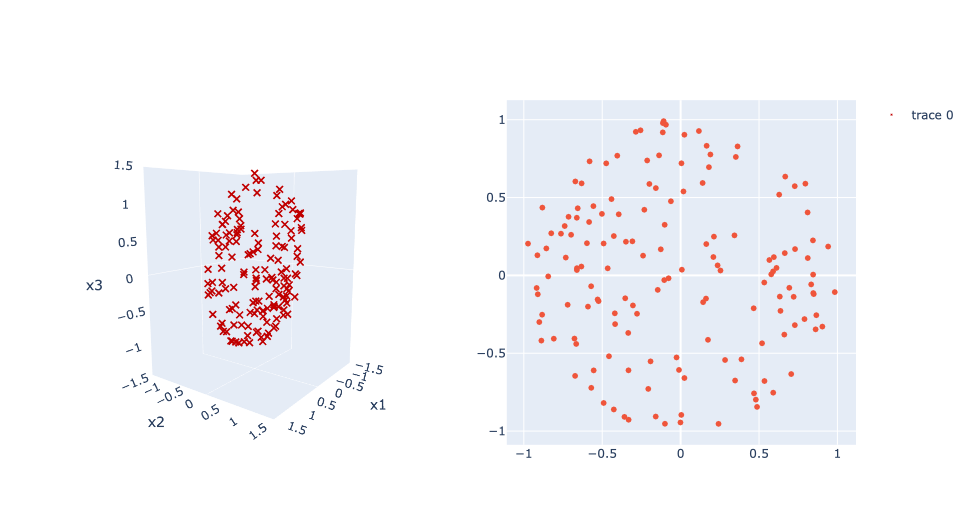 <br> <br>
- **PCA in Scikit Learn :** In Scikit-Learn, **PCA** can be implemented as follows: <br> <br>

    **Dimensionality Reduction** <br> <br>
     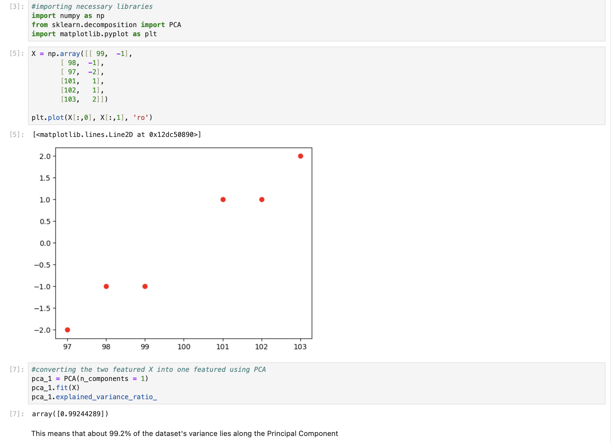 <br>
     Here, _explained_variance_ratio__ indicates how much % of the dataset's variance lies along the Principal Component.
    <br> <br>
    **Dimensionality Reconstruction** <br> <br>
    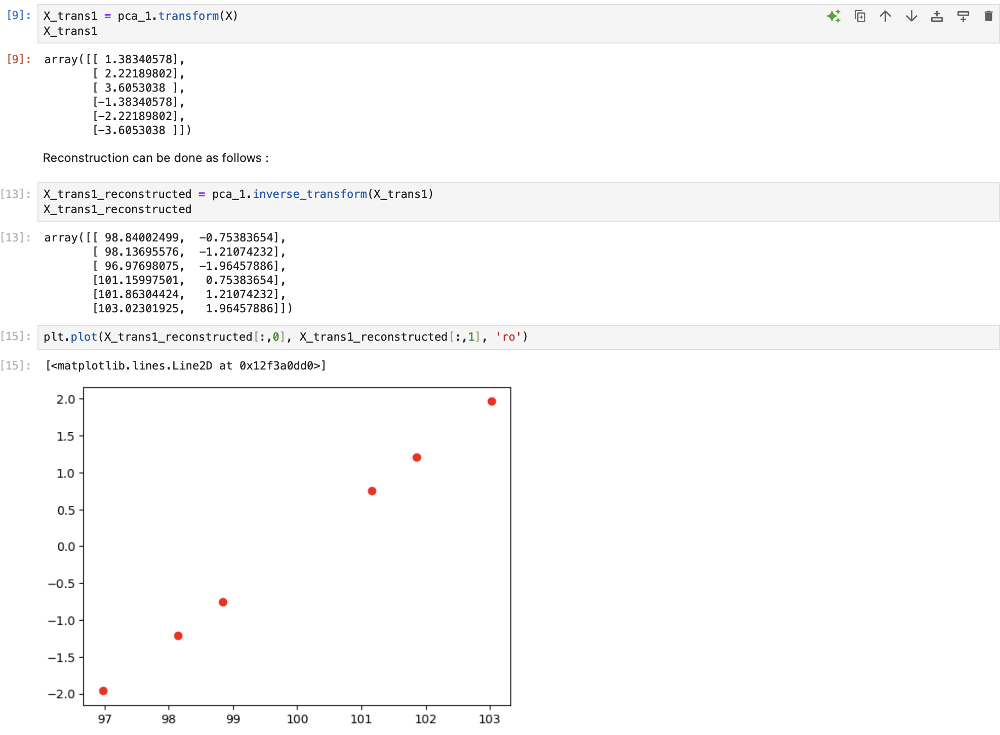
    <br> <br>

___

## Day 13

I continued studying about **Dimensionality Reduction** from the book and also took and finished the course from **Datacamp**'s
track. Well, I learnt a lot of stuffs today. So, just summarizing in few point below:

- Learnt how we can perform **Feature Selection** from the datasets using various techniques. Some of the techniques may
involve the following: <br> <br>
  i. Removing the column if it has higher number of null values. <br> <br>
  ii. Removing highly correlated features as hardly new information is brought by highly correlated features. <br> <br>
      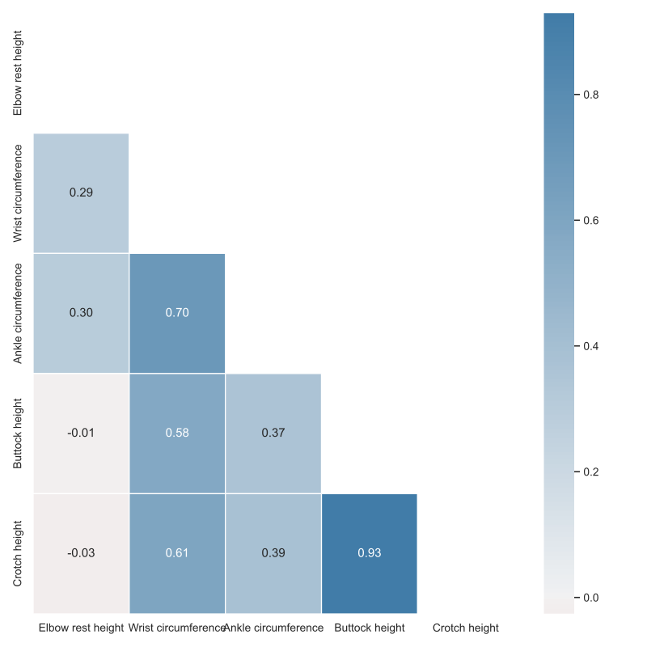
  <br> <br> Here, _Buttock height_ and _Crotch height_ has higher correlation, so one can be dropped to reduce number of 
features. <br> <br> 
  iii. Using **Recursive Feature Elimination (RFE)** method using various estimators such as LogisticRegression, RandomForest
or can also combined these features and perform voting.
<br> <br>
- Performed **Feature Extraction** using **PCA** that I have mentioned yesterday also. But gone in little bit depth today.
I learnt about choosing the right number of dimensions or **Principal Component** selection. I used few methods as mentioned below:
<br> <br> 

    **i. Variance Threshold :** Providing the variance we want, we can get the dimensions reduction in the dataset. A screenshot
of implementation attached below: <br> <br>
        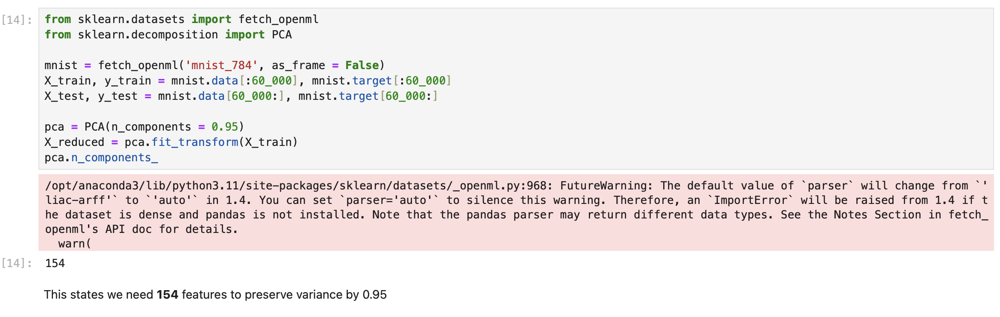 <br> <br>

    **ii. Random Search :** With the use of **Random Search** we can find the best no. of components as follows: <br> <br> 
        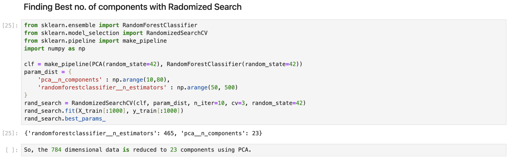 <br> <br>

    **iii. Elbow Method :** We can use elbow method to determine the number of components. For the figure below, we can
conclude that 3 _n_components_ would be fine. <br> <br> 
        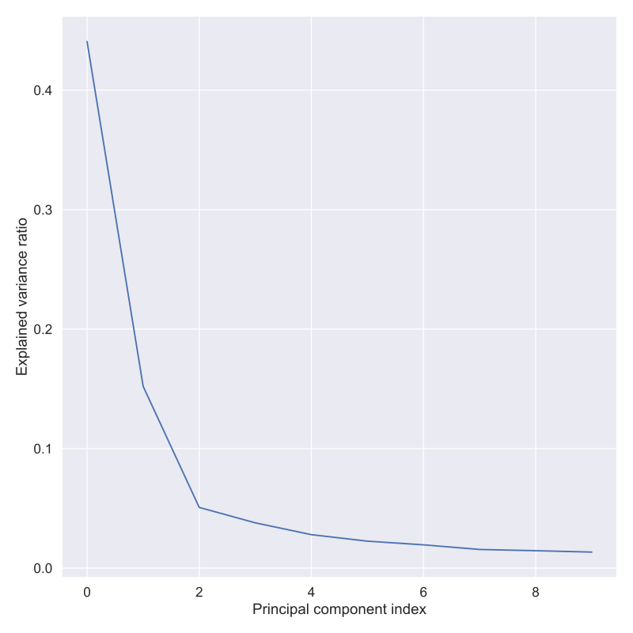 <br> <br>

- Performed **Compression** using PCA. And, also decompressed the images. You can see both before and after compression
part of datasets as follows: <br> <br>
   **Before Compression :** <br> <br>
        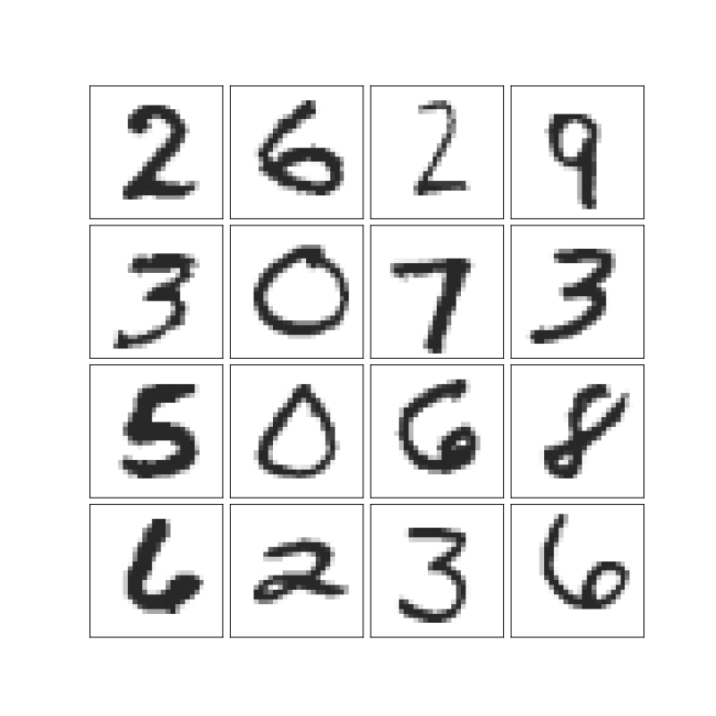 <br> <br>
   **After Compression, decompressed image :** <br> <br>
        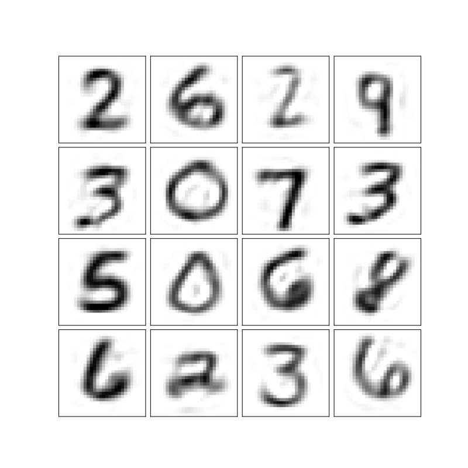 <br> <br>
 
    Pretty good !! Isn't it? That's all for today !!

___

## Day 14

Today I thought of starting a project. I researched for a while but couldn't find the one which matches my level (of course
basic) and also is satisfactory at the same time. After researching for almost an hour, I thought of coming back to the 
**Iris Flower Classification** and doing it from the scratch by own. I didn't take any reference and just started performing
everything sequentially. Created a rough notebook which you can directly visit from here : [Notebook](Day14/rough_iris_flower_classification.ipynb)

- Loaded the dataset from **sklearn.datasets**. <br> <br>
- Converted the data into dataframe and also mapped labels with their respective names. <br> <br>

  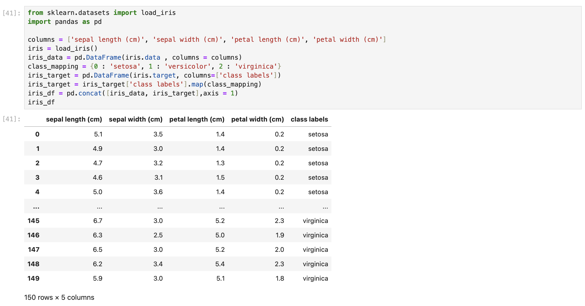 <br> <br>
- Checked for null values and observed the dataset. <br> <br>
- Visualized the data and tried to reach some conclusions. Found that **setosa** is well-separated from other two classes.
<br> <br>
    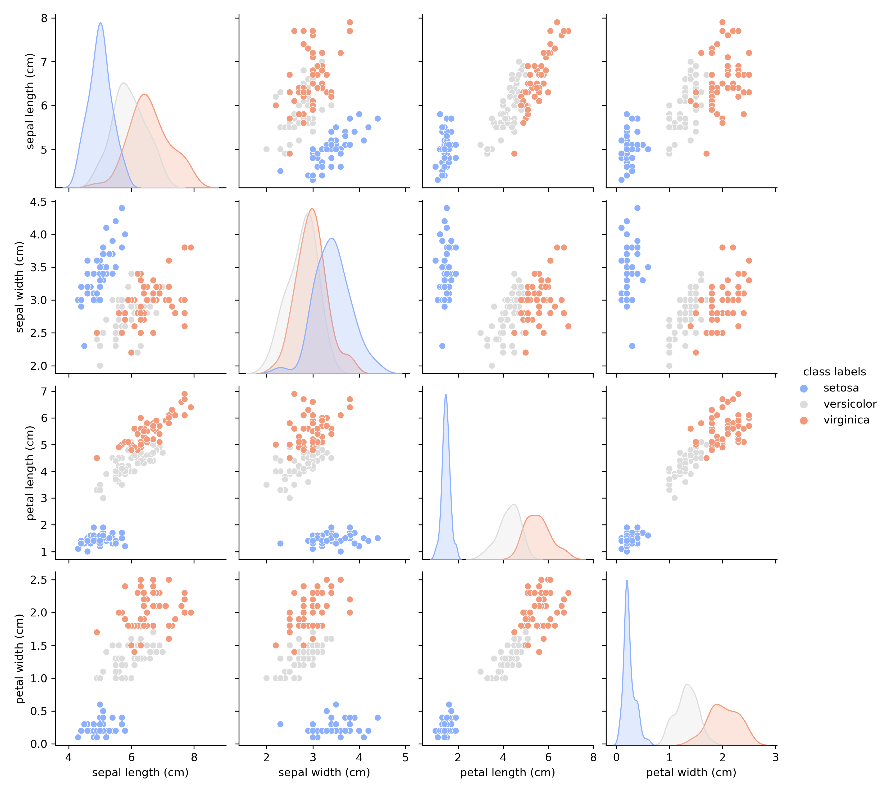 <br> <br>

- Used **Random Forest**: an ensemble learning algorithm to fit the model. It worked with 100% accuracy in training set, 
96% in Cross-validation and again 100% in test set. <br> <br>

    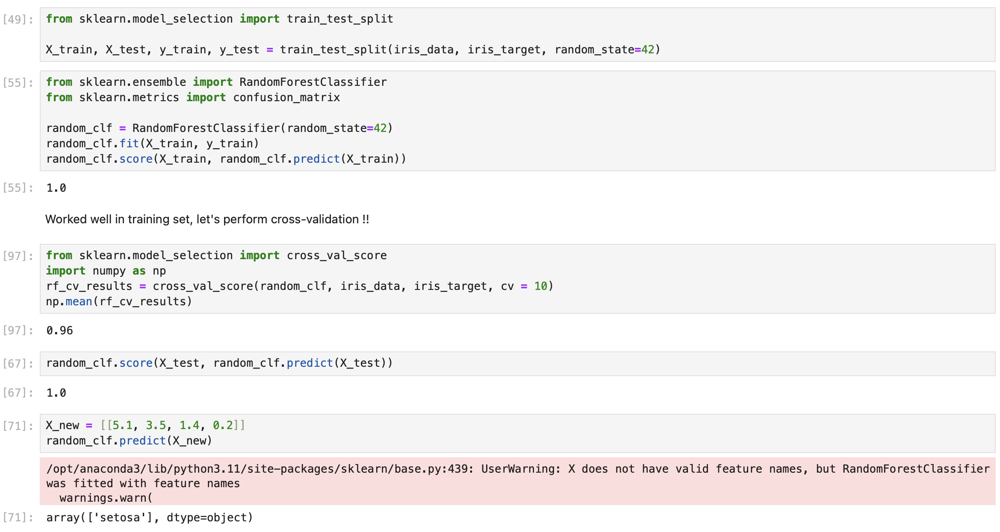 <br> <br>
    
    Also, told **ChatGpt** to generate random array for the model and tested, well it predicted accurately !! <br> <br>

But I think I just made the things little bit complex, when it can be done comparatively easily. Easy in a sense that I could
have tried other algorithm which are lesser complex as well as cheaper when it comes to bigger problems. But anyway, it was 
just a try !! So, that's fine !! I'll try to build a web interface and deploy this project using flask with some required 
changes. That's all for today !!

___

## Day 15

Deployed the project **Iris FLower Classification** using **Flask**. For web interface, used **HTML** and **CSS**. Below
are some of the screenshots of the interface and results based on inputs:
<br> <br>
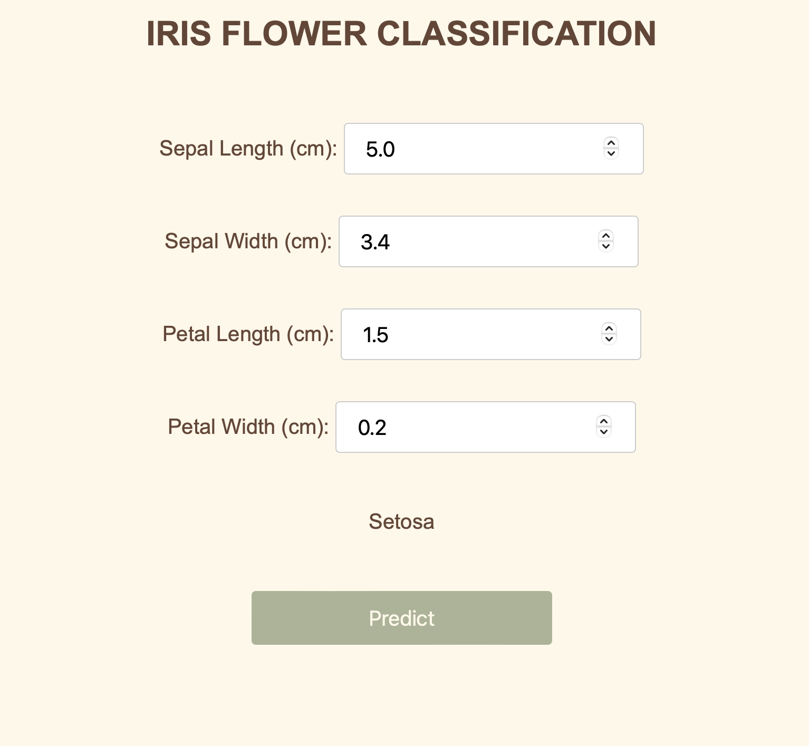 <br> <br>
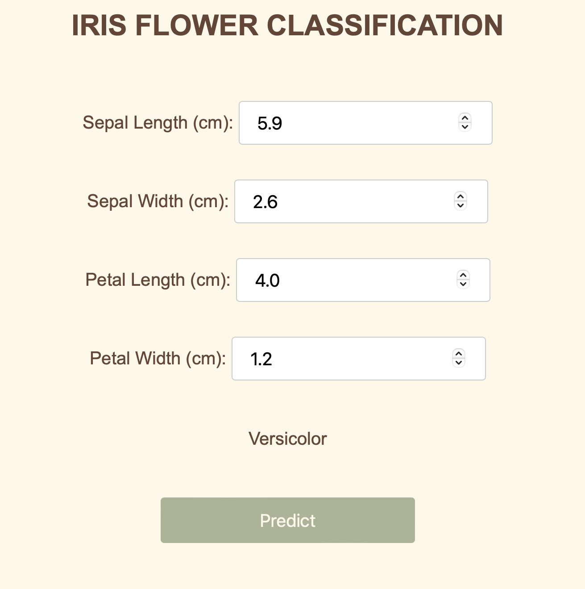 <br> <br>
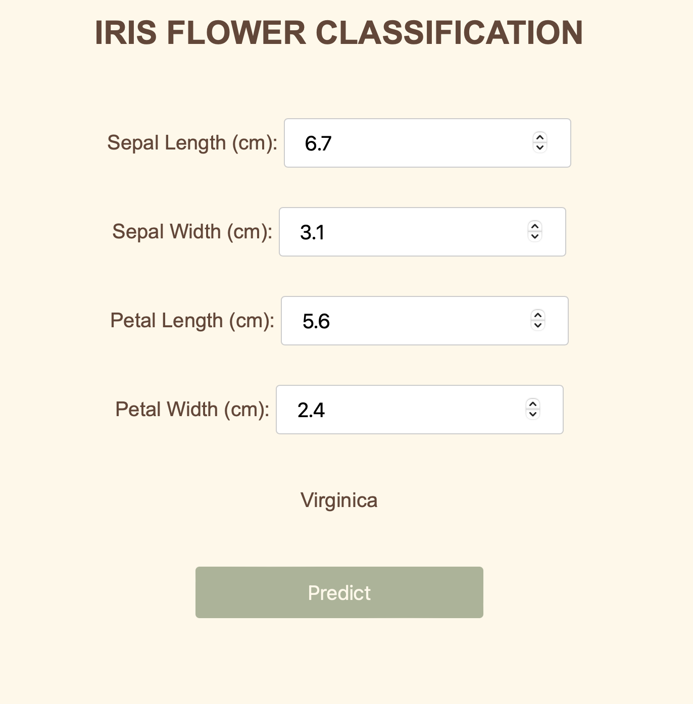
<br> <br>

Visit the full project folder here: [Iris Flower Classification](https://github.com/iamshishirbhattarai/Machine-Learning/tree/main/Iris%20Flower%20Classification)

___

## Day 16

I started learning about **Unsupervised Learning** from the book. I focused on one of the clustering algorithms : **K-Means**.
The learnings are summarised in the following points:
<br> <br>
- **Unsupervised learning** finds patterns in data. The dataset provided is unlabeled. The various tasks of **Unsupervised
Learning** are **Clustering**, **Anomaly Detection**, **Density Estimation**, etc.
<br> <br>
- **Clustering**  is the task of identifying similar instances and assigning them to clusters, or groups of similar
instances. Some of the popular **Clustering** algorithms are **K-means, DBSCAN, Hierarchical Clustering**, etc. The clustering
has wide variety of applications including **Customer Segmentation**, **Data analysis**, **Dimensionality Reduction**, 
**Feature Engineering**, **Anomaly Detection**, **Semi-Supervised Learning**, **Search Engines** and **Image Segmentation**.
<br> <br>
- Today I specifically learnt about **K-means**. It is one of the simple algorithm that clusters the instances with similar
characteristics. The algorithm follows the following key steps: <br> <br>
     **i.** A random cluster center is generated for each of the clusters. <br> <br>
     **ii.** The distance to these cluster centers is computed for each point to assign to the closest cluster. <br> <br>
     **iii.** The cluster centers are recomputed. <br> <br>
     **iv.** This iteration of assigning points to the recomputed cluster centers is performed a predefined numbers
            of times.
<br> <br>
- Implemented **Kmeans** using Scikit-Learn. <br> <br>
    
    ```python
    from sklearn.cluster import KMeans
    from sklearn.datasets import make_blobs
    import numpy as np
    
    blob_centers = np.array([[ 0.2,  2.3], [-1.5 ,  2.3], [-2.8,  1.8],
                             [-2.8,  2.8], [-2.8,  1.3]])
    blob_std = np.array([0.4, 0.3, 0.1, 0.1, 0.1])
    X, y = make_blobs(n_samples=2000, centers=blob_centers, cluster_std=blob_std,
                      random_state=7)
    
    k = 5
    kmeans = KMeans(n_clusters=k, n_init=10, random_state=42)
    y_pred = kmeans.fit_predict(X)
    plt.scatter(X[:,0], X[:,1], c=y, s=1)
    plt.grid()
    plt.show()
    ```
  <br> <br>

  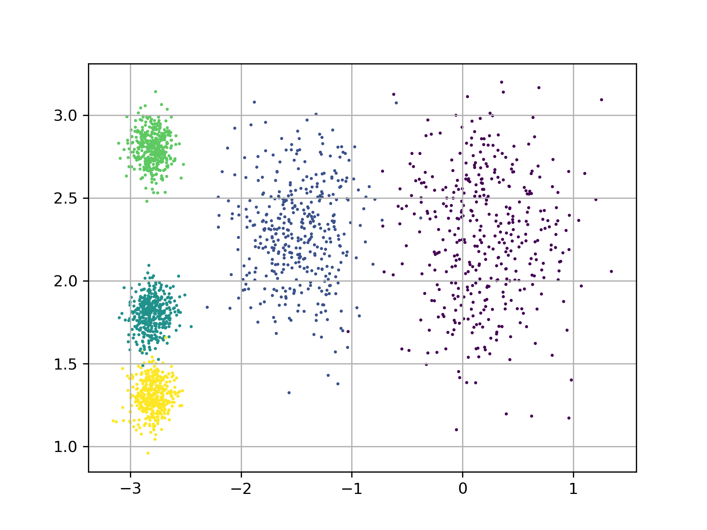

___

## Day 17

Continued reading about **Clustering Algorithms**. Today I thought of taking the related course from **DataCamp** and 
took a course on **Clustering Analysis in Python** In this course, I was first introduced to **Hierarchical Clustering**
and then **Kmeans**. Let us go a little bit deeper in both of them

- **Hierarchical clustering** is a method of cluster analysis in data mining that creates a hierarchical representation
of the clusters in a dataset. I implemented this clustering using _Scipy_. Learnt to create a distance matrix using _linkage_
and learnt about various methods that we can use within _linkage_. After that, created cluster labels with _fcluster_
and then visualized the clusters using both _Seaborn_ and _matplotlib_ but found _seaborn_ more effective as well as
easier. <br> <br>
    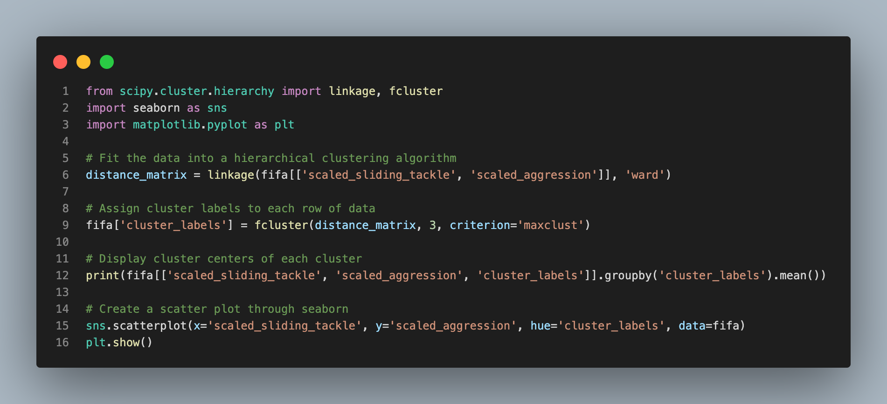 <br> <br>
    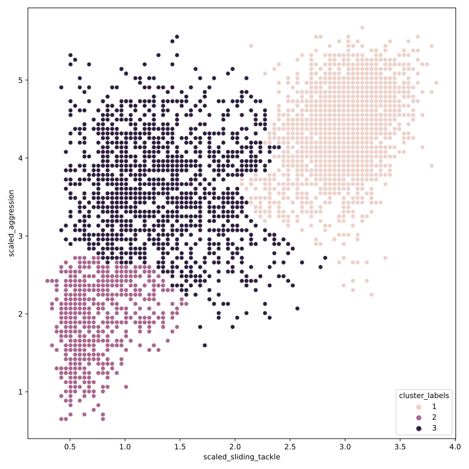 <br> <br>
- Learnt about a technique to find the number of clusters in **Hierarchical Clustering** known as **Dendrogram**. It is a 
branching diagram that demonstrates how each cluster is composed by branching out into its child nodes. It helps in showing
progressions as clusters are merged. <br> <br>
    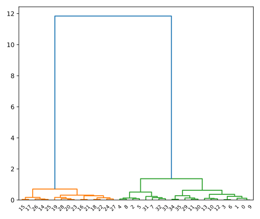 <br> <br>
By the above dendrogram, we can have some idea about number of clusters and can be chosen as 2.
<br> <br>
- Limitation of **Hierarchical Clustering** is that there is quadratic increase of runtime as data points increases. So, 
it's not feasible for large dataset. <br> <br>
- **K-means** overcomes the limitation of **Hierarchical Clustering** i.e. it runs significantly faster on larger datasets.
Yesterday I did implement the algorithm with the help of _Scikit-Learn_. Today since the course was designed on _Scipy_,
I got introduced with the syntax. Generated cluster centers with _Kmeans()_ and cluster labels with _vq()_.
<br> <br>
    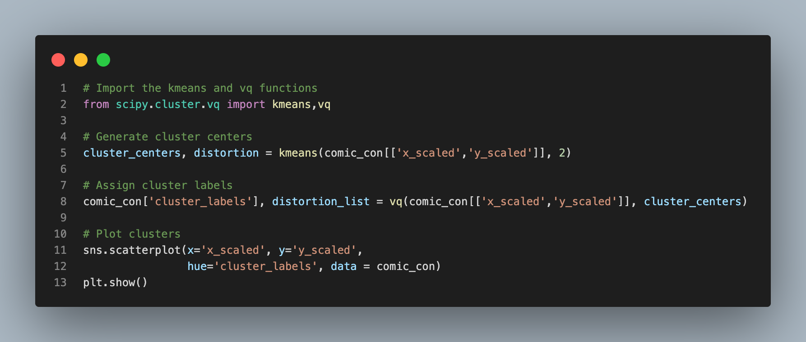 <br> <br>
    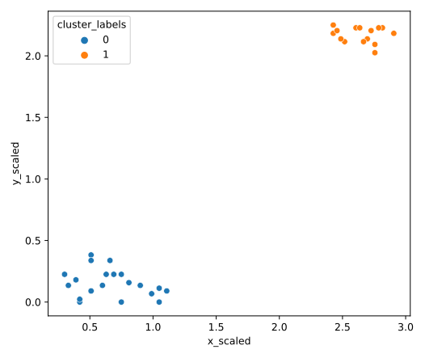 <br> <br>
- There are many methods to determine the number of clusters in **Kmeans**. But none of them are absolute method to find 
the right numbers of clusters. Today I applied **elbow method** to detect number of clusters. Distortion decreases with an
increasing number of clusters i.e. becomes zero when no. of clusters = no. of points. So, **Elbow Plot** is a line plot
between cluster centers and distortion. However, this only gives an indication of optimal K and doesn't
always pinpoint how many k (no. of clusters). <br> <br>
    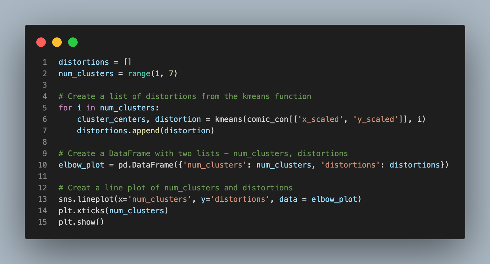 <br> <br>
    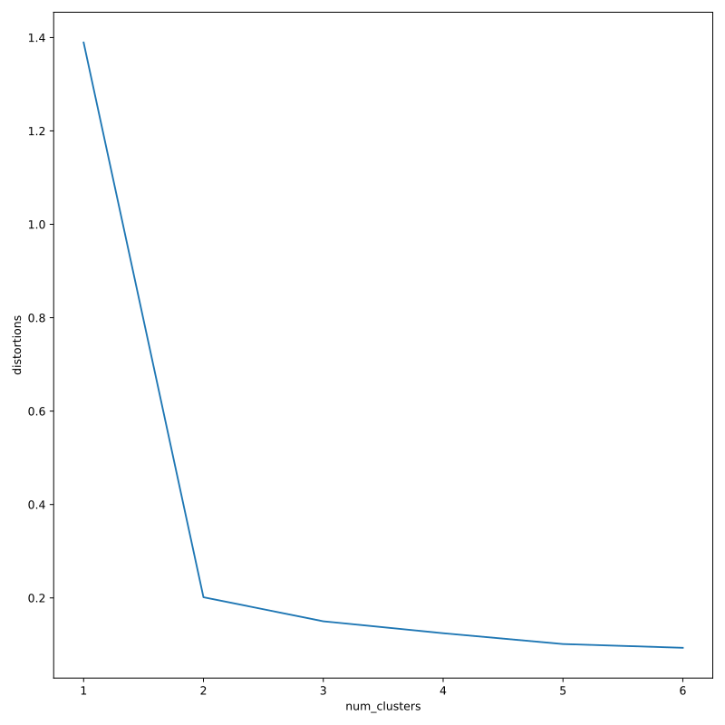 <br> <br>
With the above plot, we can take no. of clusters as 2. There is another method known as _silhouette_ which we will explore
tomorrow. <br> <br>
- There are few limitations of **kmeans**. Finding the right number of clusters, impact of seeds and biased towards equal
clusters are some of them. 
    
___ 

## Day 18

Today firstly I completed **Cluster Analysis In Python** course from **DataCamp**. Only the last chapter was remained where
I simply learnt about real world implementation of clustering. I performed **Clustering** to 
find the dominant colors in image and also performed Document clustering that involves cleaning data before processing,
determining the importance of the terms in a document (in TF-IDF matrix), clustering of the TF-IDF matrix and finding top
documents, terms in each cluster. Also performed some basic checks, visualized and found top items in clusters while dealing 
with multiple features clustering. <br> <br>
After completing the course, I came back to the book and continued where I left off. Summarizing my learnings from the book
in the following points: <br> <br>
- As promised, learnt about _silhouette coefficient_. The **silhouette coefficient** is a measure used to evaluate the 
quality of clusters in a clustering algorithm, such as K-means. It quantifies how well each data point fits within its 
assigned cluster compared to other clusters. The silhouette coefficient combines both cohesion (how close the points in
a cluster are) and separation (how distinct or far away a cluster is from other clusters). Applied **Silhouette Coefficient**
to find the optimal numbers of clusters in _Scikit Learn_. <br> <br>
    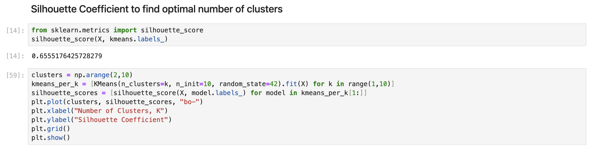 <br> <br>
     <br> <br>

As we can clearly see from the above figure that **at K=4**, the Silhouette Coefficient is higher. A coefficient close to +1 
means that the instance is well inside its own cluster and far from other clusters, while a coefficient close to 0 means 
that it is close to a cluster boundary; finally, a coefficient close to –1 means that the instance may have been assigned 
to the wrong cluster. So, **K=4** might be the right option. However, **K=5** is also pretty good, so it's better to apply
and choose the better result at the end. <br> <br>
- Performed **Image Segmentation** using Clustering. It is the task of partitioning an image into multiple segments. Here, 
I did color segmentation, that generally assigns pixel with similar colors to the same segment. You can see a simple 
implementation of color segmentation below: <br> <br>

    **The Original Image:** <br> <br>
     <br> <br>
    **Code Implementation:** <br> <br>
     <br> <br>
    **Segmented Image:** <br> <br>
     <br> <br>

___
    
## Day 19

I continued studying about clustering from the book. 


- Learnt about **DBSCAN** algorithm. A small distance _epsilon_ is considered. Randomly a _core instance_ is taken and 
the neighbors within the _epsilon_ distance belong to the same cluster. If those neighbors consists of **min_samples**
instances as defined, then they are also considered as **_core instance_** otherwise they are **_non-core instances_** and aren't
capable of expanding the cluster. Instance that is not a core instance or isn't within its neighborhood is considered an 
anomaly. In Scikit-Learn, an instance that's anomaly is assigned with the label -1. We can simply implement **DBSCAN**
as follows: <br> <br>
    ```python
    from sklearn.cluster import DBSCAN
    from sklearn.datasets import make_moons
    
    X,y = make_moons(n_samples=1000, noise=0.05)
    dbscan = DBSCAN(eps=0.05, min_samples=5)
    dbscan.fit(X)
    ```

    But **DBSCAN** doesn't have predict function to predict the cluster for new instances so using some classification 
algorithm, we can perform the prediction task. <br> <br>
- Simply Got Introduced with other various clustering algorithms such as **Agglomerative clustering**, **BIRCH**, **Mean-shift**
**Affinity propagation** and **Spectral clustering**. <br> <br>

- Learnt about **Gaussian Mixture Model (GMM)**. It is a probabilistic model which assumes that the datas are generated from a
combination of several Gaussian distributions. **Gaussian Distribution** is a distribution with most of the datas gathered
around the center(mean) and fewer points away from the center. It generally form a shape of bell. In **GMM**, each Gaussian
represents a cluster of data. It first make some initial guesses of number of Gaussian's and where they might be. After that
performs **Expectation-Maximization (EM)** algorithm where in **E** it calculates the probability of each points belonging
to each gaussian (cluster) and in **M** it adjusts the parameter of Gaussians to better fit the datas based on the probabilities
calculated in **E-step**. This process is repeated until the model stabilizes. <br> <br>

     <br> <br>
- **Bayesian GMM** is also a type of GMM. Rather than manually finding the optimal number of clusters, use of
this model provides us the weight equals or near to zero for the unnecessary clusters. Implementation for the same problem
as above is done below with number of clusters as 15. <br> <br>
     <br> <br>


**IMPORTANT : With this I completed the Machine Learning Portion i.e. Part I of the book. Now, the rest of the parts
consists of the Deep Learning Things which I will be covering on DeepLearning challenge in the future !!**

___

## Day 20

As you know I completed the book portion and now I am on my way to finish the **Datacamp** track. So, following the track
I learnt about **Preprocessing for Machine Learning in Python**. I have almost applied everything in my first project 
[**California Housing Price Prediction**](https://github.com/iamshishirbhattarai/Machine-Learning/tree/main/California%20Housing%20Price%20Prediction)
which you can visit with the link provided. Simply, the course was all about Standarization, Log Normalization, Feature Scaling,
Standardized data and Modeling, Encoding of Binary Variables, One hot encoding, engineering numerical features, text features
(just a surface introduction) and feature selection. I spent about 3 hours in this course and it was quite a good revision
with the stuffs. Almost documented about everything in the previous days, which you can visit if you want :) <br> <br>
 **A Sample Code** <br> <br>
 
That's all for today !!!
    
___   

## Day 21

Today I started the another course from the **DataCamp** and the course is about **Machine Learning for Time Series Data in Python**.
Learnings are compiled in the following points.

- **Time Series Data** is data that changes overtime. It at least consists of a series that consist data and another series
consisting timepoints. <br> <br>
   <br> <br>
- Performed loading and reading auditory data using **glob** and **librosa** library. <br> <br>
      <br> <br>
- Read about **Auditory Envelope** The auditory envelope refers to the smooth curve that outlines the extremes of an audio
signal's waveform in the time domain. It represents the variation in amplitude (loudness) of a sound over time, essentially
capturing the overall shape of the signal's amplitude fluctuations. Implemented by rectifying the audio and rolling the rectified
audio. <br> <br> **Original Audio:** <br> <br>  <br> <br> **Audio Envelope:** <br> <br>
     <br> <br>
- Read about **Tempogram** that estimates the tempo of a sound overtime. And also the **Spectogram** that is a collection of
windowed **Fourier Transforms** over time. **Fourier transforms** converts a single timeseries into an array that describes the timeseries
as a combination of oscillations. Calculated the **STFT** and spectral features and also visualized the spectrogram using 
Matplotlib. Just a sample code is provided below <br> <br>
     <br> <br>  

___

## Day 22

Continued the same course **Machine Learning for Time Series Data in Python** and got it completed today. Learnings are 
compiled in few points below: <br> <br>
- Predicted the data over time and also visualized. Performed interpolation wherever the data was missing. Interpolation
is a technique used to estimate unknown values that fall within the range of known data points. By using existing data, 
interpolation creates a continuous function to predict values at intermediate points. Common methods include linear 
interpolation, which connects points with straight lines, and spline interpolation, which uses piecewise polynomials for
smoother estimates. <br> <br>
- Used Rolling window to transform data. A common transformation to apply to data is to standardize its mean and variance 
over time. <br> <br>
- Created features from the past with time shifting. Performed Cross Validating Time Series Data. <br> <br>
    
Just had the understanding today and simply performed the inbuilt exercises of the course, will come back to this whenever
required. Thank you :)

___

## Day 23

Today I started the next course about **Feature Engineering for Machine Learning in Python**. There were almost similar things
I learnt in the past. I did have all those concepts but I went a little bit deeper with the concepts. Learnings are compiled
in the following points: <br> <br>

- Revised about Dummy encoding and One hot encoding in **pandas**. Syntactically, if I have to talk, then there is just one
difference of adding **drop_first = True** in dummy encoding. While in implementation, the difference is Dummy encoding 
omits one category to avoid multi collinearity, while one-hot encoding includes a binary column for every category.
<br> <br> **One Hot Encoding** <br>
    ```python
     pd.get_dummies(df, columns=['Country'], prefix='C')
    ```

    **Dummy Encoding** <br>
    ```python
    pd.get_dummies(df, columns=['Country'], drop_first=True, prefix='C')
    ```
<br>

- Also performed **binarizing** and **binning** in numerical variables.**Binarizing** converts data into binary format (0 or 1),
while **binning** groups continuous values into discrete intervals or bins. The implementation can be seen below: <br> <br>
**Binarizing :** <br>
    ```python
    df['Binary_violation'] = 0
    df.loc[(df['Number_of_violations']>0, 'Binary_violation']=1)]
    ```
  <br> <br>

   **Binning :** <br> <br>
     <br> <br>
- Got to understand about how missing values exists in the dataset. This can be due to data not being properly collected, 
collection and management errors, data intentionally being omitted or could be created due to transformation of the data. 
And also, revised about dealing with missing values as well as other data issues such as bad characters and other stray 
characters. 
 


___

## Day 24

Today I completed the course that I started yesterday **Feature Engineering for Machine Learning in Python**. In the remaining
portion of the course I learnt the following stuffs: <br> <br>
- Learnt about Data distribution and what can be done to handle the skewed data and outliers. For skewed data, we mostly 
perform **Min-Max Scaling**, **Standardization** and **Log Transformation** and while dealing with outliers, we calculate
**quartiles** and handle the datas or perform **Standard deviation based detection**. <br> <br>
**Quantiles In Python** <br> <br>  <br> <br>
**Standard Based Outlier Detection** <br> <br>  <br> <br>
- Dealt with text datas where I performed removal of unwanted characters, Standardize the case, converted text to columns
and found common words. Used **CountVectorizer**;  a tool in natural language processing that converts a collection of
text documents into a matrix of token counts, representing the frequency of each word in the vocabulary across the documents.
Similarly, revised about **TF-IDF** which helps to highlight words that are unique and meaningful, while downplaying common 
words that appear everywhere, like **the** or **is**. Also had a concept on N-gram where n n-gram is a sequence of n 
consecutive words or tokens from a text, used in natural language processing to capture word patterns and context, where
n can be 1 (unigram), 2 (bigram), or more. Few implementations: <br> <br>
**CountVectorizer :** <br> <br>  <br> <br>
**NGrams** <br> <br> 

___

## Day 25

Today I started learning about **Model Validation In Python**. The learnings are summarized as follows: <br> <br>

- The course simply reviewed me through the introduction to model validation, regression models, classification models
in the initial chapters, where I solved some exercises related to them. <br><br>
- In the next chapter, I was again revised with the creation of training and testing sets, accuracy metrics in regression
model such as **Mean Absolute Error** and **Mean Squared Error**, Confusion Matrices, Precision vs recall, The bias-variance
trade-of, etc. Here also, I performed some exercises based on this. <br> <br>
  **Precision Sample Code:** <br> <br>
    
Few chapters within this track are so repetitive. Since I kept in my syllabus to be covered I need to finish it, so don't
mind :)

___

## Day 26

Today I completed the course that I started yesterday i.e. **Model Validation In Python**. The remaining portions were about
Cross-validation and some light touch to the hyperparameter tuning. I almost have covered a lot of portion of that in previous
days, but there were few new things that I discovered. The summarized compilation of today's learning are as follows: <br> <br>
- Performed splitting with the help of **KFold** stored as _splits_ and divided the set into training and validation set as
the code snapshot provided below. The KFold function in scikit-learn is used to split a dataset into a specified number of 
folds (subsets) for cross-validation, ensuring that each fold is used as both training and validation sets in different iterations.<br> <br>
   <br> <br>
- Performed some exercises on cross-validation with the use of _Sklearn's_ **cross_val_score()**. We have already performed
this in previous days in many of our exercises and projects that we have covered. <br> <br>
- The new thing I learnt today was about **Leave-One-Out Cross Validation (LOOCV)**. It is a special case of k-fold cross-validation 
where the number of folds is equal to the number of data points, meaning each data point is used once as a validation set 
while the remaining data points form the training set. This approach provides an almost unbiased estimate of the model 
performance since it tests on every single data point, but it can be computationally expensive for large datasets due to 
the need to train the model multiple times. **LOOCV** is especially useful when working with small datasets, as it maximizes
the use of available data for training. A small implementation is provided in below snapshot: <br> <br>
     

___

## Day 27

Today I started the new chapter that is about **Hyperparameter Tuning In Python**. Well, this is the last chapter that is
kind of revision for me. After this chapter, completely new stuffs are coming. <br> <br>
- Learnings were pretty similar. Revised about hyperparameters and parameters of various algorithms such as Logistic Regression,
Linear Regression, Random Forest, Gradient Boosting, etc. From extracting and exploring to setting and analyzing hyperparameter 
values with learning curves were per formed. A snapshot of the implementation is provided below: <br> <br>
**Code Snap:** <br> <br>  <br> <br>
**Learning Curve:** <br> <br>  <br> <Br>

- The next chapter was about **Grid Search** which I have well covered in previous days. But, I got chances to revise as 
well as practice the inbuilt exercises with the course. 

___

## Day 28

Today I completed the chapter that I started yesterday which was about **Hyperparameter Tuning In Python**. Today's first
chapter was about **Random Search** which I have pretty covered in previous days and implemented it too. **Grid Search**
and **Random Search** are **Uninformed Search** where each iteration of hyperparameter tuning doesn't learn from the previous
iterations. Today I learnt about the **Informed Search** which learns from the previous iterations. Learnt stuffs are compiled
below : <br> <br>
- **Coarse to Fine Tuning :** <br> <br>
    It starts out with a rough random approach and iteratively refine the search. The process includes the following: <br>
    1. Random Search
    2. Find Promising Areas
    3. Grid Search In Smaller Area
    4. Continue until optimal score is obtained. <br> <br>
  
   This utilizes the advantages of both grid and random search. Uses Random search to select over larger areas and Grid Search
ot find the optimal within the selected area making it better in terms of spending of time and computational efforts. <br> <br>
- **Bayesian Statistics :** <br> <br>
   In Bayesian statistics for informed search, prior knowledge is updated with new data to refine predictions and guide 
the search process. This approach uses probabilistic models to estimate the likelihood of different outcomes, optimizing 
search efficiency by focusing on the most promising areas based on updated beliefs. Simple Baye's code implementation is also
attached below: <br> <br>  <br> <br>

  The general process for Hyperparameter tuning is : <br>
  1. Pick a hyperparameters combination
  2. Build a model
  3. Get new evidence (The score of the model)
  4. Update beliefs and choose better hyperparameters the next round. <br> <br>
  
  I simply performed exercise based on this using **Hyperopt** library by setting the domain, optimization algorithm and 
the function. Snapshot of the exercise is kept below: <br> <br>
     <br> <br>

- **Genetic Algorithm :** <br> <br>
  A genetic algorithm is a search optimization technique inspired by natural selection, where potential solutions evolve 
over generations through processes like selection, crossover, and mutation. It iteratively improves a population of candidate
solutions to find the best fit for a given problem by mimicking the principles of biological evolution. The Hyperparameter 
tuning process involves the following: <br> 
  1. Create some models.
  2. Pick the best (By scoring function).
  3. Create new models that are similar to the best ones.
  4. Add in some randomness so we don't reach local optimum.
  5. Repeat until we are satisfied/happy. <br> <br>
  
  Implemented this using **TPOT** library. Let's be familiar with few of its components: <br> <br>
  1. **generations:** iterations to run training for.
  2. **population_size:** no. of models to produce in each iteration.
  3. **mutation_rate:** The proportion of pipelines to breed each iteration.
  4. **scoring:** The function to determine the best models.
  5. **cv :** cross-validation  <br> <br>
  
  Visit the simple example's snapshot below: <br> <br>
    

___
  
## Day 29

Today I started the new course from the **DataCamp's** Track which was about **Introduction To Natural Language Processing**.
Learnings are summarized below in points: <br> <br>
- Learnt about **Regular Expressions** in depth. RegEx are strings with a special syntax that allows us to match patterns
in other strings. It has a wide range of applications such as to find all web links in a document, to parse email address, 
to remove/replace unwanted characters. Implemented this using **re** library. <br> <br> 
 **Syntax** <br> 
  ```python
  import re
  re.match(pattern, string)
  ```
  There are other activities such as _split_, _findall_, _search_, etc. which can be used in place of _match_ as per the 
requirements. Studied about common RegEx pattern and also Regex ranges and groups. A simple implementation's snapshot is
provided below: <br> <br>
     <br> <br>

- Studied about **Tokenization**. It is the process or technique of turning a string or document into tokens (small chunks).
Some examples can be breaking out words or sentences, separating punctuations and separating all hashtags in a tweet. 
Tokenizing is necessary as it is easier to map part of speech, match common words and remove unwanted tokens. Implemented 
tokenization with the help of **nltk** library. There are various **nltk** tokenizers such as _word_tokenize_ which 
tokenize sentence into words, _sent_tokenize_ which tokenize a document into sentences, _regexp_tokenize_ that tokenize a 
string or document based on a regular expression pattern and also _TweetTokenizer_ that is used for tweet tokenization allowing
to separate hashtags, mentions, exclamation points. A simple code implementation of the tokenizers are as follows: <br> <br>
     <br> <br>  <br> <br>
- Got to know about **Bag-of-words** which is a basic method for finding topic in a text. For this, it is needed to first 
create tokens using tokenization and then count up all the tokens. The more frequent word, the more important it might be.
So, it generally helps to know the significance words in a text. Implemented this using **Counter** from **collections**: <br> <br>
     <br> <br>
- Performed simple text processing with the use of **RegEx**, **stopwords** from **nltk.corpus**. Also did **Lemmatization**
in inbuilt exercise of the course. It is generally a process of reducing a word into its base or root form. Examples: Running
to Run, Crying to Cry, Bigger to Big, Better to Good, etc. <br> <br>
- Got introduced with **Gensim** which is a popular open source library designed for topic modeling and document similarity 
analysis. Studied about Mathematics behind **Tf-idf** value calculation. Higher TF-IDF indicates terms that are frequent 
in a document but rare in overall corpus making them important keys for that document.

___

## Day 30

Continuing the **Introduction to NLP** course from Datacamp's Track, today I learnt about **Named Entity Recognition**.
Summarizing the learning in following points: <br> <br>

- **Named Entity Recognition (NER)** is a natural language processing (NLP) technique that identifies and categorizes key
entities within a text, such as names of people, organizations, locations, dates, and other specific terms. NER models 
analyze the context and syntactic structure of sentences to tag these entities accurately. It helps in transforming 
unstructured text into structured data, which can be used in various applications like information retrieval, summarization, 
and question-answering systems. NER uses machine learning algorithms or rule-based approaches, with modern systems often
relying on deep learning for improved accuracy. This technology is crucial for tasks that require extracting actionable 
information from large volumes of text data. <br> <br>
- Implemented **NER** with **nltk** library. A simple codesnap is provided below: <br> <br> 
 <br> <br>
- Got Introduced with **SpaCy** library. It focuses on creating NLP pipelines to generate models and corpora. Using **SpaCy**
can be beneficial due to various reasons such as Easy Pipeline creation, different entity types compared to **nltk** and
informal language corpora. A quick implementation's snapshot is provided below: <br> <br> 
<br> <br>
- Had a brief introduction to **Polyglot** library and performed Multilingual NER (Specifically Spanish) in inbuilt exercise
of the course. This library has vectors for more than 130 languages. 

___

## Day 31

Today I completed the course **Introduction to NLP in Python**. The remaining portion was about classification task in NLP.
Learnings are summarized below: <br> <br>
- Used **CountVectorizer** and **TfidfVectorizer** for text classification in inbuilt exercises of the course. <br> <br>
- Have a introductory understanding of **Naive Bayes Classifier**.
The Naive Bayes Classifier is a probabilistic machine learning model used for classification tasks, based on Bayes' theorem
with the assumption of independence between features. It is called "naive" because it assumes that all features contribute 
independently to the probability of a class label, which simplifies computation even though it might not always reflect reality. 
Despite this simplification, Naive Bayes often performs well in many practical applications, especially for text classification 
tasks like spam detection or sentiment analysis. It calculates the posterior probability of each class given the input features
and selects the class with the highest probability. Naive Bayes is fast, efficient, and particularly effective with high-dimensional
data, making it suitable for large datasets. However, its limitations include the strong independence assumption, which 
may not hold true in real-world data, leading to less accurate predictions. It also struggles with handling continuous 
variables directly without discretization or transformation. Additionally, Naive Bayes can be sensitive to the presence of 
irrelevant features, and it may not perform well if the frequency of words or features is crucial to understanding the context,
such as in complex text data. Finally, it assumes that all features contribute equally to the outcome, which can be unrealistic
in many situations where some features are more informative than others. Simply implemented the classifier with the help 
of **sklearn** library. Code Snap is attached below: <br> <br>
     <br> <br>

___


## Day 32

I started the new course which is about **Natural Language Processing With spaCy**. Already had been shortly introduced 
with the library in previous course. But, this time going on detail. Today I just became familiar with the syntax to perform
few basic tasks using the library. Few are mentioned below: <br> <br>

- **spaCy** introduction: It is a free, open-source library for NLP in python which is designed to build system for information
extraction and supports 64+ languages. Also has visualization library. <br> <br>
- Learnt about **spaCy NLP Pipeline**. The spaCy NLP pipeline processes text by passing it through several stages, including
tokenization, part-of-speech tagging, dependency parsing, named entity recognition (NER), and other linguistic annotations.
Each component in the pipeline performs a specific task, transforming the `Doc` object step by step, allowing for efficient
and streamlined natural language processing. <br> <br>
- Became familiar with pipeline components and their basic syntax. Few Implementations are attached below: <br> <br>
  **Tokenization With Spacy :** <br> <br>  <br> <br>
  **Sentence Segmentation With Spacy :** <br> <br>  <br> <br>

- Also performed **lemmatization**, **POS tagging**, **NER** and also got introduced with **displacy** visualizer.

___

## Day 33

I continued the course that I started yesterday and went little bit deeper with Linguistic Annotations and Word Vectors.
The learnings are compiled below: <br> <br>

- Learnt about **Dependency Parsing**. Dependency parsing is the process of analyzing the grammatical structure of a sentence
by identifying how words are related to each other, typically in terms of subjects, objects, and modifiers. It represents
these relationships in a tree-like structure, where words are connected by directed edges that signify their dependencies.
Learnt a basic implementation with **spaCy**. We can even visualize with **displacy** following the syntax below: <br> <br>
    ```python
     from spacy import displacy
     doc = nlp(text)
     spacy.displacy.serve(doc, style="dep")
    ```
  
  Also **.dep_** attribute can be used to access the dependency label of a token. <br> <br>
     <br> <br>

- Studied about **spaCy Vocabulary** and also perform word vectors visualization. For this, the PCA need to be done as 
there were high dimensions of data. PCA were implemented as follows: <br> <br>
     <br> <br>
  Then it was simply visualized using **matplotlib**. <br> <Br>

- Learnt to find the **similarity score**: a metric defined over texts. It uses cosine similarity and word vectors. Cosine 
similarity is any number between 0 and 1. A larger cosine similarity metric represents more similar word vectors and vice-versa.
Found similarity score between documents, sentences and spans whose snapshots are attached below: <br> <br>
    **Document similarity score** <br> <br>  <br> <br>
    **Sentence similarity score** <br> <br>  <br> <br>
    **Span similarity score** <br> <br> 

___

## Day 34

I finished the course about **NLP with spaCy**. In the remaining portion of the course, it was about data analysis with 
spaCy and customizing spaCy model. Learnings are compiled below: <br> <br>

- Learnt to add and analyze pipelines in spaCy. Got the concepts on spaCy EntityRuler, spaCy RegEx, spaCy Matcher and 
phraseMatcher. Provided a simple code snapshot below ofspaCy EntityRuler implementation: <br> <br>
    <br> <br>
- Trained an existing NER model and a spaCy model. <br> <br>
     <br> <br>
    

___

## Day 35

Today I thought of doing a project and started a classification project i.e. **Breast Cancer Detection**. Let's summarize
whatever I did during the project in few points as follows: <br> <br>
- Loaded the dataset and observed it. Found an unnecessary column named **Unnamed: 32** which had only NAN values. So, I 
dropped it and revisited the dataset. Other columns were fine and had no null values. <br> <br>
- Splitted data into training and testing set. The dataset has total of 569 datas where 357 were **"B" (Benign) i.e. no cancer**
and 212 were **"M" (Malignant) i.e. cancer**. I tried **Random Forest**, **KNN** and **XGBoost** for the classification.
**KNN** really didn't perform well, so not including it. While **randomly sampled**, the results were as follows: <br> <br>
**Random Sampling** <br> 

  | Metrics | Random Forest | XGBoost |
  | ---- | ----| ---|
  | Accuracy Score | 0.9649 | 0.9561 |
   | Recall | 0.9302 | 0.9523 | <br> <br>
 
     <br> <br> 
    <br> <br> Since we had smaller dataset and the data was kind of imbalanced. So, thought of using **Stratified Sampling Method**.
     The performances are tabulated below: <br> <br>
  **Stratified Sampling** <br> 

  | Metrics | Random Forest | XGBoost |
  | ---- |---------------|---------|
  | Accuracy Score | 0.9561        | 0.9737  |
   | Recall | 0.8809        | 1.0     | <br> <br>

    Visit the notebook to see the result in detail :  [**Breast Cancer Detection**](https://github.com/iamshishirbhattarai/Machine-Learning/blob/main/Breast%20Cancer%20Detection/breast_cancer_detection.ipynb)
<br> <br>

In this Project, we need to focus on **recall** rather than other metrics as In cancer detection, a higher recall ensures 
that as many actual cancer cases as possible are identified, reducing the risk of missing patients who have cancer. 
Missing a cancer diagnosis (false negative) can delay treatment, potentially leading to worse health outcomes. Although 
higher recall may increase false positives, it prioritizes catching all possible cancer cases, which is crucial for early 
intervention and treatment. So, found **XGBoost** as a better choice but I will still work on this tomorrow and do some
fine tunings and finalise the project.

___

## Day 36

Today I continued refining the yesterday's project. I simply performed hyperparameter tuning on the **XGBOoost** and 
increased the **Accuracy Score** from **0.9737** to **0.9912**. Also, the **cross-validation score** increased from something
around **0.96** to **0.97**. <br> <br>
-  <br> <br>

Visit the complete project here : [**Breast Cancer Detection**](https://github.com/iamshishirbhattarai/Machine-Learning/blob/main/Breast%20Cancer%20Detection/breast_cancer_detection.ipynb)

___

## Day 37

Today I started learning a new course from **Datacamp's** track. The title of the course is **Introduction to Deep Learning with PyTorch**.
Today I simply became familiar with what's Neural Networks, Activation functions (Sigmoid & Softmax) and syntaxes of 
**PyTorch**. Basic introduction to these topics with whatever I understood are provided below: <br> <br>
- A **neural network** is a computational model inspired by the structure of the human brain, consisting of layers of interconnected
nodes (neurons) that process input data to learn patterns and make predictions. It uses weights and biases, adjusted through training
, to minimize error and improve its performance on tasks like classification or regression. <br> <br>
- An **activation function** is a mathematical function applied to the output of a neural network's neuron, determining whether
it should be activated or not. It introduces non-linearity into the model, enabling the network to learn and solve complex 
problems beyond simple linear relationships. Learnt two types of **activation function**: <br> <br>
   1. **Sigmoid Function** is an activation function that maps input values to a range between 0 and 1, commonly used for 
binary classification tasks. <br> <br>
  2.  **Softmax Function** The softmax function is an activation function that converts a vector of raw scores into probabilities 
by normalizing them, ensuring the output values sum to 1, commonly used for multi-class classification. <br> <br>

- Became familiar with the basic syntax of **PyTorch**. <br> <br>
     
___

## Day 38

Started the next chapter of the course **Introduction to Deep Learning With PyTorch**. Today I learnt about the **Forward
pass** abd **Backward Pass**, **Loss Function** , **Optimizer** and **Training Loop In PyTorch**. Below are some summary
of whatever I learnt: 

- **Forward Pass** involves passing input data through the layers to compute the output (predictions) while 
**Backward Pass** calculates the gradients of the loss function with respect to the network's parameters using backpropagation,
enabling the model to update its weights. <br> <br>
- A **loss function** in a neural network quantifies the difference between the predicted output and the actual target values.
It guides the optimization process by providing feedback on how well the model is performing, allowing adjustments to improve accuracy.
<br> <br>
- An **optimizer** in a neural network adjusts the model's parameters based on the gradients calculated during the backward
pass to minimize the loss function. It uses various algorithms, such as stochastic gradient descent or Adam, to effectively
navigate the parameter space and improve model performance. <br> <br>
- ALso learnt about **training Loop** in PyTorch and implemented some inbuilt exercises. <br> <br>
- A simple implementation of multiclass classification is done and a snapshot of the code is provided below: <br> <br>
    

___

## Day 39

Today I completed the course **Introduction to Deep Learning with PyTorch**. The remaining chapters were about 
**Neural Network Architecture and Hyperparameters** and **Evaluating and Improving Models**. 

- Learnt about **RELU** and **Leaky RELU**. 
ReLU outputs zero for negative inputs while Leaky ReLU allows a small, non-zero output for negative inputs, preventing
dead neurons during training. For positive inputs, the output is same as the input in both of those activation functions.
<br> <br>
- Learnt about **Learning Rate** and **Momentum**. The **learning rate** controls the size of the steps taken during optimization;
a higher learning rate can speed up training but risks overshooting minima, while a lower rate can lead to more precise convergence
but may slow down the process. **Momentum** helps accelerate optimization by accumulating past gradients to smooth out updates, 
allowing the model to navigate through ravines and accelerate in the relevant direction. <br> <br>
- Got to study about **Transfer Learning** and **Fine-Tuning**. **Transfer learning** is a machine learning technique where a
model developed for a specific task is reused as the starting point for a model on a second, related task, allowing it to
leverage the knowledge gained from the first task to improve performance on the new one. In **Fine-Tuning**, not ever layer is 
trained. Generally, early layers of network are frozen and later layers close to output layers are fine-tuned (making small
adjustments on pre-trained model). 
- Recalled **Data Loading**, **Evaluating Model Performance** using **loss** and **accuracy metrics**. Also, Learnt to
avoid **overfitting** and fine tuning basics using **Grid Search** and **Random Search**. <br> <br>
Few snapshots of the code during exercise are attached below: <br> <br>
  **Validation Loss** <br> <br>  <br> <br>
  **TensorDataset** <br> <br>  <br> <br>

****Note :** This is just introductory courses that I am recently doing, so that it gets easier during **Deep Learning** Journey.
That's why I am not going much in detail. I will cover all these topics very well in the particular journey.**

___

## Day 40

I started the new course **Intermediate Deep Learning with PyTorch** which is the continuation of the previous one.
The first chapter of the course was about Training Neural Network in a robust way using **Object-Oriented Approach**. The
learnings are summarized below: <br> <br>
- Loaded the dataset using **OOP** approach. <br> <br>
     <br> <br>
- Got familiar with class based model definition. <br> <br>
     <br> <br>
- Performed training loop and model evaluation. <br> <br>
- Learnt to deal with **vanishing and exploding gradients** with **proper weight initialization** (Using **He/Kaiming** initialization),
**good activation**(**ELU**) and **Batch Normalization**. **He/Kaiming initialization** initializes the weights of neural networks
by drawing values from a distribution scaled by the inverse of the square root of the number of input units, ensuring stable
gradients and improved convergence in deep networks, particularly with ReLU activation functions.
**ELU (Exponential Linear Unit)** is an activation function that smooths out the negative values exponentially while keeping
positive values linear, helping to avoid vanishing gradients and improving learning speed.
**Batch Normalization** normalizes the input of each layer in a neural network by scaling and shifting it based on the batch 
statistics, improving training stability and allowing for higher learning rates.

___

## Day 41

Continuing the same course that I started yesterday, today I studied the next chapter which was about **Images And 
Convolutional Neural Networks**. Learnings are compiled in the following points: <br> <br>
- Loaded images and also performed **Data Augmentation**. **Data Augmentation** is the process of Generating more data by applying
random transformations to original images. It helps to increase the size and diversity of the training set which improves
model robustness and reduces overfitting. <br> <br>
  <br> <br>
- Got to know about **Convolutional Neural Network(CNN)**. It is a type of deep learning model designed for processing 
structured grid-like data such as images. It uses convolutional layers to automatically extract features, pooling layers
to reduce dimensionality, and fully connected layers for classification or regression tasks. <br> <br>
     <br> <br>
- Trained Image Classifier and also evaluated averaging multi-class metrics such as Recall and Precision. A snapshot of
training image classifier is attached below: <br> <br>
    

___

## Day 42

Continued the same course. Learnt about **RNN**, **LSTM** and **GRU**. Learnings are summarized below: <br> <br>
- Understood about **RNN** ,**LSTM** and **GRU**. **Recurrent Neural Networks (RNNs)** process sequential data by passing
information between time steps but struggle with long-term dependencies due to vanishing gradients. **Long Short-Term Memory**
**(LSTM)** networks solve this by using gates to control the flow of information, allowing them to retain or forget information
as needed. **Gated Recurrent Units (GRUs)** are a simplified version of LSTMs, combining some of the gates for greater efficiency 
while still effectively capturing long-term dependencies. <br> <br>
- Implemented **LSTM** and  **GRU**. <br> <br>
   **LSTM :** <br> <br>  <br> <br>
    **GRU :** <br> <br>  <br> <br>
- Performed Training Loop and Evaluation Loop. <br> <br>
    **Train Loop :** <br> <Br>  <br> b<br>
    **Eval Loop :** <br> <br> 

___

## Day 43

Completed the course **Intermediate Deep Learning with PyTorch**. The remaining portion was about **Multi-Input And Output
Models** along with their **evaluation**. Summarizing in below points: <br> <br>

- Learnt about **Multi-input models** and implemented them. Snapshots are attached below: <br> <br>
   **Two Input Dataset :** <br> <br>  <br> <br>
   **Two Input Architecture :** <br> <br>  <br> <br>
- Also learnt about **Multi-output models**, implemented it and also evaluated the model. Two output Dataset can be similarly
fetched as **Two-Input Dataset**<br> <br>
    **Two Output Architecture :** <br> <br>  <br> <br>
    **Evaluation :** <br> <br>  <br> <br>

___

## Day 44

Started a new course **Image Processing In Python** from the same **Datacamp's Track**. Today's learnings are compiled 
as follows: <br> <br>
- Learnt about the purpose of **Image Processing** and got introduced with **scikit-image** library. <br> <br>
- Converted RGB to GrayScale and Vice-versa. Here, **show_image()** is a predefined function to display image.  <br> <br>
    **Code For RGB To Grayscale** <br> <br>  <br> <br>
    **Original Image** <br> <br>  <br> <br>
    **Grayscaled Image** <br> <br>  <br> <br>
- Used **Numpy** to fip images using **np.flipud()** for vertical flip and **np.fliplr()** for horizontal flip. <br> <br>
- Learnt about **thresholding**. Thresholding in image processing is a technique used to segment an image by converting 
grayscale images into binary images, where pixel values are set to either 0 or 1 based on whether they are below or above a
certain threshold value. Used **try_all_threshold()** to automatically tests multiple global thresholding algorithms on an 
image and displays the results for comparison. Similarly, The `threshold_otsu()` function in image processing calculates 
an optimal global threshold value for an image using Otsu's method, which minimizes intra-class variance between foreground and background pixels. <br> <br>
    **try_all_threshold() Code** <br> <br>  <br> <br>
    **Output** <br> <br>  <br> <br>
    **threshold_otsu() Code** <br> <br>  <br> <br>
    **Output** <br> <br> 
___

## Day 45

Continued the course and today I learnt about **Edge Detection**, **Gaussian Smoothing** and **Contrast Enhancement**. 
Learnings are summarized below: <br> <br>
- Performed **Edge Detection** using **Sobel Learning ALgorithm**. **Edge detection** is a technique used to identify the boundaries 
of objects within an image, and the **Sobel algorithm** in scikit-image is a filter that computes the gradient magnitude of the image 
intensity to highlight edges. <br> <br>
 **Code** <br> <br>  <br> <br> **Output** <br> <br>  <br> <br>
- Also performed **Gaussian Smoothing** is a technique that applies a Gaussian filter to an image, blurring it to reduce noise
and detail by averaging pixel values based on a Gaussian function. <br> <br>
   **Code** <br> <br>  <br> <br> **Output** <br> <br>  <br> <br>
- Learnt about **Contrast Enhancement**. It is a process that improves the visibility of an image by adjusting the intensity 
differences between its light and dark areas, making features more distinguishable. Used **Histogram equalization** and 
**Adaptive Histogram Equalization**. Details provided below: <br> <br>
    1. **Histogram equalization** spreads out the most frequent intensity values. <br> <br>
        **Code** <br> <br>  <br> <br> **Original And Resulting Image**
  <br> <br>  <br> <br>  <br> <br>
  2. **Adaptive Histogram Equalization** enhances contrast in an image by applying histogram equalization locally to small 
regions, rather than the entire image, to improve visibility of details in both bright and dark areas. <br> <br>
        **Code** <br> <br>  <br> <br> **Original and Resulting Image** <br> <br>
         <br> <br> 


___

## Day 46

Continuing the course, today I learnt about **Transformations**, **Morphology** and just a slight touch on **Image Restoration**.
Learnings are compiled in the following points: <br> <br>
- **Transformations**  are operations that modify an image's appearance, structure, or pixel values. They can change the 
image's geometry (like size, position, and orientation), adjust intensity or color values, and enhance or detect features in the image.
Performed **Rotation**, **Rescaling** and **Resizing** of the images. Just code snapshots for the basic syntax are attached
below: <br> <br>
    **Rotate-Rescale** : <br> <br>  <br> <br>
    **Resize** : <br> <br>  <br> <br>
- Learnt about **Morphology**. It involves techniques that analyze and manipulate the shapes and structures of objects within images.
Studied two techniques within it. They are as follows: <br> <br>
     1. **Dilation** adds pixels to the boundaries of objects in an images i.e. it expands the boundaries. It can be simply
  implemented as follows : 
         ```python
        # Import the module
        from skimage import morphology
        
        # Obtain the dilated image 
        dilated_image = morphology.binary_dilation(world_image)
        ```
          
    2. **Erosion** removes pixels from the boundaries of objects in an image. It shrinks the boundaries. It can be simply
  implemented as follows : 
        ```python
        # Import the morphology module
        from skimage import morphology
        
        # Obtain the eroded shape 
        eroded_image_shape = morphology.binary_erosion(upper_r_image)
       ```
<br> <br>

- Just touched **Image Restoration**. Being specific, performed **Inpainting**. It is the process of reconstructing lost 
parts of images after looking at the non-damaged regions. Below the **mask** is pre-defined, which provides the pixels as 0
for the parts which are defected. Have a simple look on its basic implementation: <br> <br>
     ```python
     # Import the module from restoration
    from skimage.restoration import inpaint
    
    # Show the defective image
    show_image(defect_image, 'Image to restore')
    
    # Apply the restoration function to the image using the mask
    restored_image = inpaint.inpaint_biharmonic(defect_image, mask, multichannel=True)
    show_image(restored_image)
  ```
  
___

## Day 47

Today I learnt about **Noise**, **Superpixels and Segmentations**. Learnings are compiled below: <br> <br>
- **Noise** refers to unwanted random variations in pixel intensity that can distort or obscure the visual information in an image.
Learnt to introduce the **noise** in the image and also **denoise** using **Total-Variation(TV)** and **Bilateral Filter**. 
The **Total-Variation filter** removes noise by smoothing out small changes in an image while keeping edges sharp, and the 
**Bilateral filter** smooths the image but keeps edges clear by taking into account both how close pixels are and how similar their colors are.
<br> <br>
    **Total Variation :**  <br> <br>
    **Bilateral Filter :**  <br> <br>

- Learnt about **Superpixels and Segmentations**. 
**Superpixels** group nearby pixels with similar color or intensity into meaningful regions, while **segmentation** divides an 
image into distinct parts to better identify and analyze objects or structures. Used **SLIC (Simple Linear Iterative Clustering)**
: an unsupervised method to perform segmentation. <br> <br>
    **SLIC :** 

___
